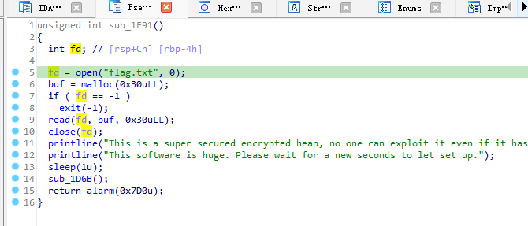
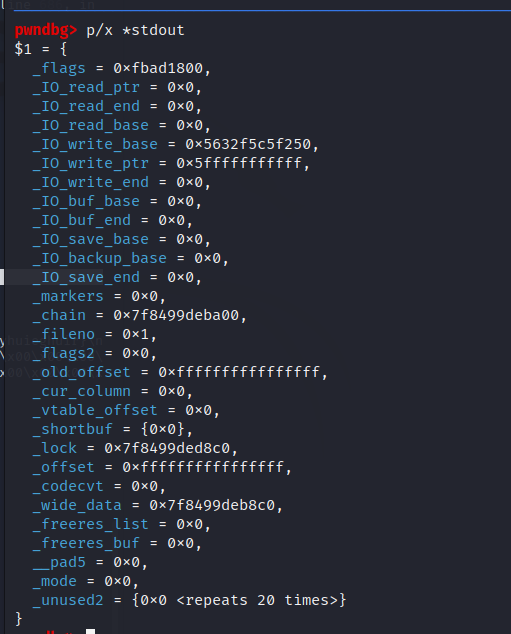

# leak  
首先需要注意此题libc版本为2.27 1.6，此版本的tcache中会有双指针，而如果是2.27 1.4则没有双指针。 
保护全开，而且没有show函数。  
但是会把flag读取到一个堆块中，要想办法打印出来。  
  
将stdout结构体修改后可以在调用puts或者printf时输出指定内容，然而这道题里没有这两个函数，但是程序在exit时会将剩余内容输出（貌似是这个机制）。  
我们希望得到的stdout是类似这样的结构。
  
```
pwndbg> p/x *stdout
$1 = {
  _flags = 0xfbad1800,
  _IO_read_ptr = 0x0,   /* Current read pointer */
  _IO_read_end = 0x0,   /* End of get area. */
  _IO_read_base = 0x0,  /* Start of putback+get area. */
  _IO_write_base = 0x5632f5c5f250,  /* Start of put area. */
  _IO_write_ptr = 0x5fffffffffff,   /* Current put pointer. */
  _IO_write_end = 0x0,  /* End of put area. */
  _IO_buf_base = 0x0,   /* Start of reserve area. */
  _IO_buf_end = 0x0,    /* End of reserve area. */
  _IO_save_base = 0x0,  
  _IO_backup_base = 0x0,    
  _IO_save_end = 0x0,
  _markers = 0x0,
  _chain = 0x7f8499deba00,
  _fileno = 0x1,
  _flags2 = 0x0,
  _old_offset = 0xffffffffffffffff,
  _cur_column = 0x0,
  _vtable_offset = 0x0,
  _shortbuf = {0x0},
  _lock = 0x7f8499ded8c0,
  _offset = 0xffffffffffffffff,
  _codecvt = 0x0,
  _wide_data = 0x7f8499deb8c0,
  _freeres_list = 0x0,
  _freeres_buf = 0x0,
  __pad5 = 0x0,
  _mode = 0x0,
  _unused2 = {0x0 <repeats 20 times>}
}
```
需要修改的地方为flag、_IO_write_base、_IO_write_ptr  
修改完成功程序运行到exit时便会从_IO_write_base开始逐个字节输出直到_IO_write_ptr或者打印到不可打印区域停止。  


