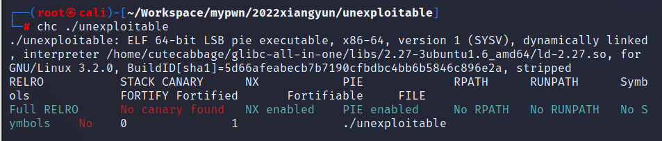
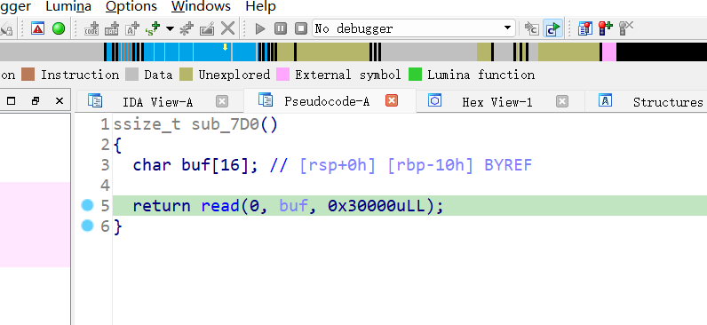
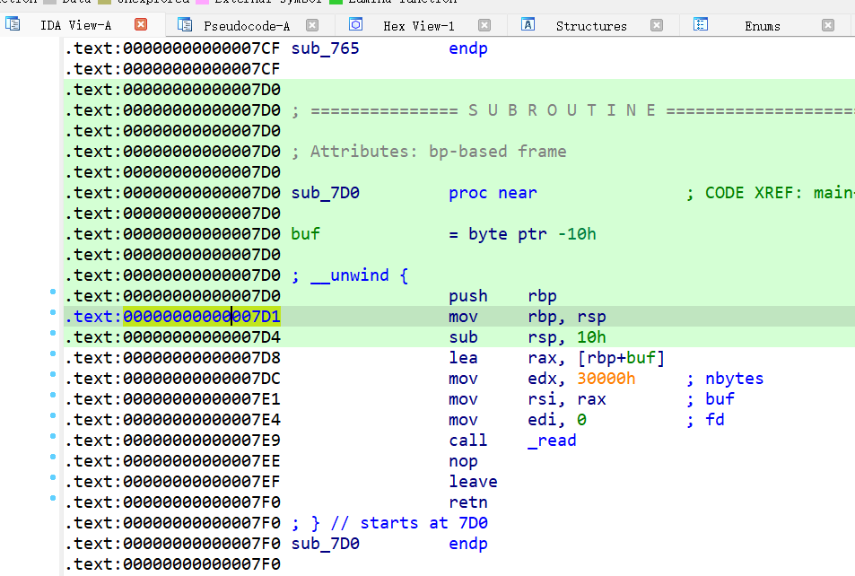
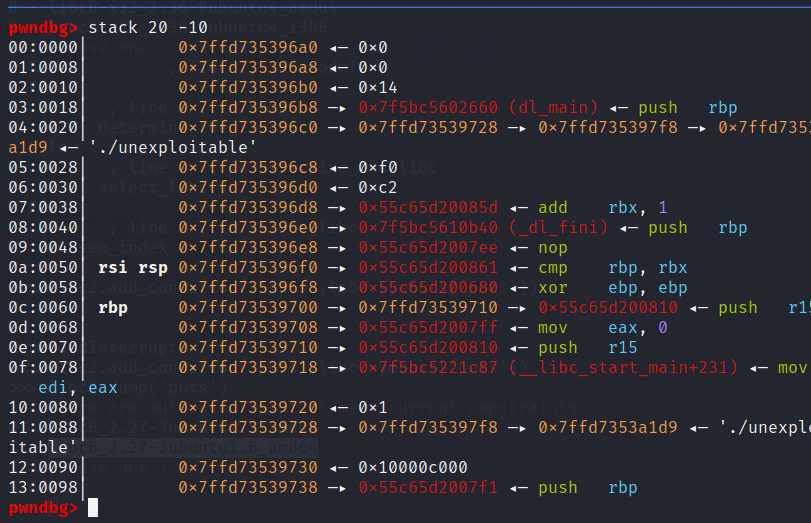
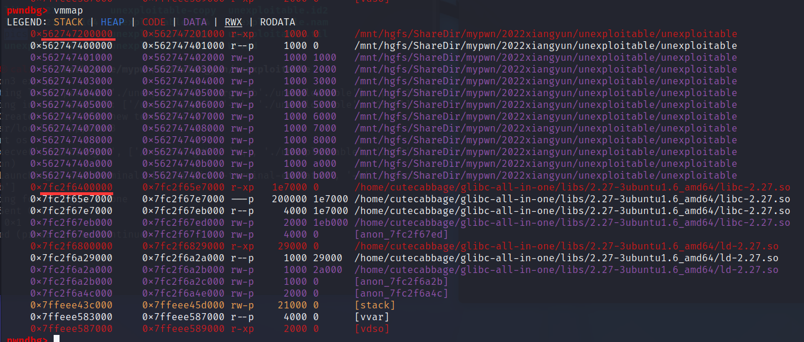

# unexploitbale
  
  
  
非常明显的栈溢出，可是除了canary别的保护全开了，不然直接写shellcode了。  
看看栈溢出时的栈  
  
发现距离rbp下面第三个字段有libc地址，中间夹着两个程序地址，可以将程序地址改为漏洞函数地址达到重复利用漏洞并让rbp逐步接近libc地址的目的。  
漏洞函数的地址是0x07D0，第一个指令是push rbp，这里将返回地址末字节改为0x71，这样一次就能使rbp紧贴到libc函数地址上面。  
之后第二次利用漏洞时将libc改为one_gadget地址，需要爆破3个半字节。  

做这题时发现的奇怪的地方：  
我的机器不知道为啥libcbase和pie的程序基地址偏移永远是末尾5个0(一般都是只有三个0才对)，导致我自己只需要爆破半字节出结果，而在别人机子上得爆破三个半字节。  
  
此外由libc版本可以得知远程使用的机子是ubuntu16.04，可以利用固定地址的vsycall（0xffffffffff600000），它相当于return，因此只需构造一次payload发送即可。  
```
p64(0xdeadbeef)*3+p64(0xffffffffff600000)*2+b'\xa5\x22\x06'
```
爆破成功概率与上面的做法相同。
