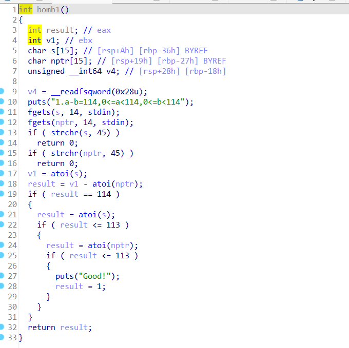
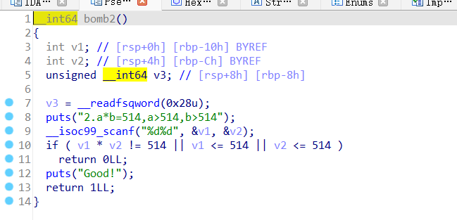
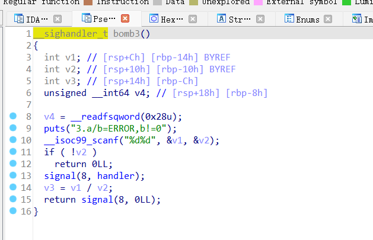

# int_over
闯关题，只要通过三关即可，由ctfshow的math99这道题改编而来，考查机器码层面的整数数据存储  
  
这关不允许输入负数，而希望的是113-(-1)=114，由于int存储时2^32 为一个循环，所以输入113和2^32-1=4294967295即可  
  
同理，把2^32+514质数分解即可  
  
int存储范围为-2^31 ~2^31 -1，a输-2^31，b输-1即可  
