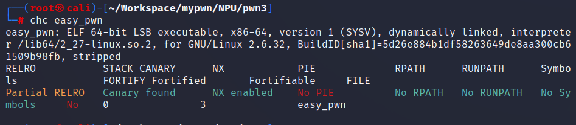
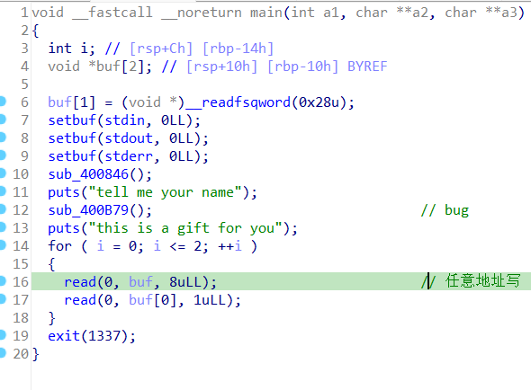
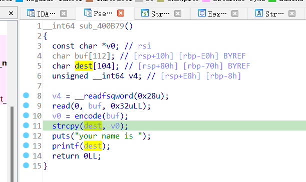
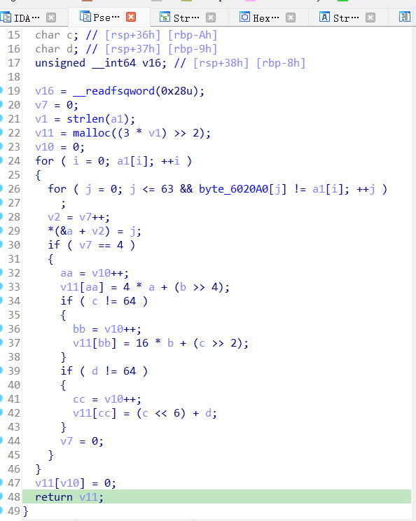

# pwn2  
格式化字符串漏洞，而且在利用完漏洞后可以有3次机会任意地址写1字节  
  
  
  
但是输入的字符串没有直接传入dest，而是经过了一次编码。  
编码函数如下  
  
是base64编码，只要写出解码函数就行，但是我不会。所以我用z3求解器无脑写了个解码函数。  
```
destring='7M9BXCGPswHRFxvbdaNgyVilEmpD/foYhTznK6Lkj5A+t3W20reUZO18QcSqJI4u'
def decode(aa,bb,cc):
    a=Int('a')
    b=Int('b')
    c=Int('c')
    d=Int('d')
    s=Solver()
    s.add(a>=0 , a < 64)
    s.add(b>=0 , b < 64)
    s.add(c>=0 , c < 64)
    s.add(d>=0 , d < 64)
    s.add(aa==(4*a+(b-b%16)/16)%256)
    s.add((16*b+ (c-c%4)/4)%256==bb)
    s.add(cc==(d+64*c)%256)
    print(s.check())
    print(s.model())
    m=s.model()
    return m.eval(a),m.eval(b),m.eval(c),m.eval(d)
def realpayload(payload):
    payload=payload.ljust(len(payload)+len(payload)%3,b'a').decode()
    print(payload)
    ans=b''
    for i in range(len(payload)//3):
        print(ord(payload[3*i]),ord(payload[3*i+1]),ord(payload[3*i+2]))
        m=decode(ord(payload[3*i]),ord(payload[3*i+1]),ord(payload[3*i+2]))
        # print(m[0].as_long(),m[1].as_long(),m[2].as_long(),m[3].as_long())
        ans+=destring[m[0].as_long()].encode()+destring[m[1].as_long()].encode()+destring[m[2].as_long()].encode()+destring[m[3].as_long()].encode()
    # print(ans)
    return ans
```
如此只要传入想构造的payload就能得到原始payload  
思路：
每4个字符经过base64后生成3个字符，把payload补齐后按4个字符一组传进去就行了  
接下来我做的事如下：  
1. 利用格式化字符串漏洞获得libcbase和stack_addr  
2. 利用任意地址写把exit函数的got表改为main函数里任意地址写的前面的地址，这样可以无限次利用  
3. 多次利用任意地址写在rbp下面构造rop链，并将\bin\sh写到bss段  
4. 构造完成将exit的got表改为return的地址，退出重复调用    

细则：
libc和stack的地址分别处于第31和34个参数，用%p输出得到  
  
此次rop链使用execve法，要点如下：  
64位下要使rax为0x3b，rdi为"\bin\sh"的地址，rsi和rdx为0  
没用其他方法（system，onegadget）是因为不知道为什么把exit改了以后有很多函数就不能再调用了，包括当时本来想把exit直接改成格式化字符串漏洞函数前的地址，但试了之后发现在调用printf时出错了，system等函数也是一样。  
