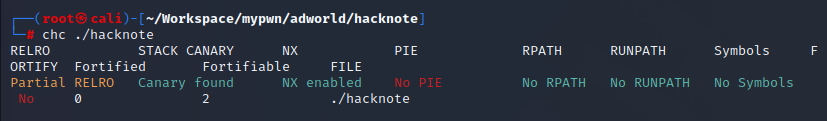
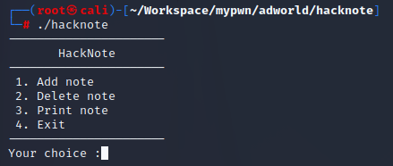
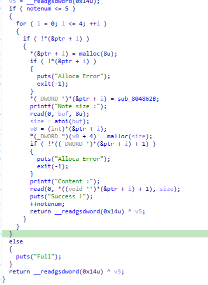
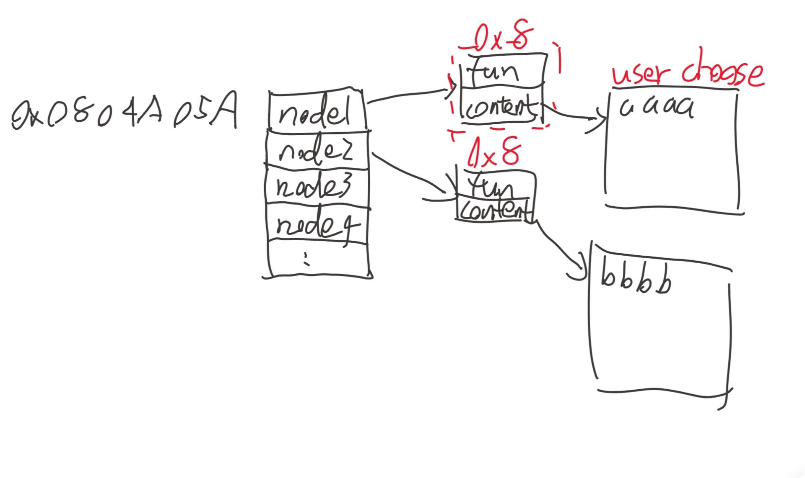
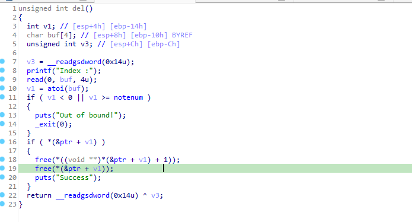

## hacknote 
又是一道自己本地打不通但远程打得通的题，哈哈  
32位签到难度的堆题，但我还是对着答案做了好几个小时才打通，真的要崩溃了  
checksec结果  
  
除此之外本题提供了libc
题目为可以增加、删除、输出note  
  
add函数  
  
通过add后的node结构如下

其中fun为0x804862B对应的函数，当用户选择3时，会将该函数所在位置4字节后的内容打印（即content）  
  
  
看看delete函数，发现在清空指针后并没有释放野指针  
  
下面是执行del后区域的变化  
  
到这里可以初步判断此题属于UAF  

思路：  
构造两个note（context不为8）后将他们free，之后再申请context大小为8的note，这样便能将note0的输出函数进行更改。输出函数仍然保持为0x804862B，context指针变为puts_got，这样只需要打印第0个note就能泄露puts地址得到libcbase。  

接下来再次add note，这次放入system函数，其实这里我仍然没搞懂，如果说之前调用0x804862B的参数是存储位置之后的四字节那我能了解，但是这个system的参数我还是不能不理解，其他人写的WP说system的参数是从他本身开始的内容，又由于除了system_addr只能放下4字节了，因此只能写';sh\x00'或';sh;'，而'||sh'我试过了行不通，因为不能保证sh后面是截断。  
至于真正理解system传参问题还是只能交给以后的自己了。

