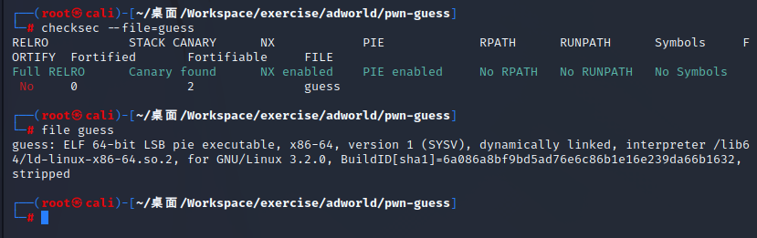
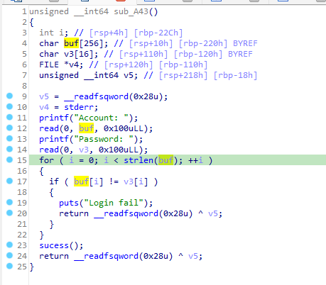
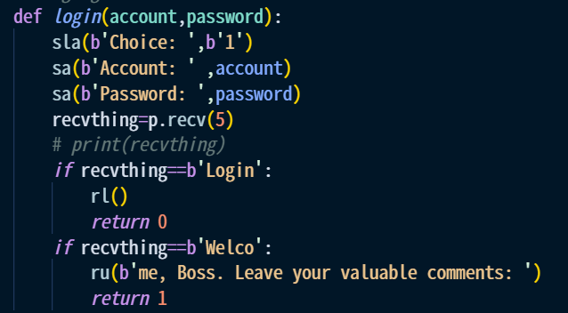
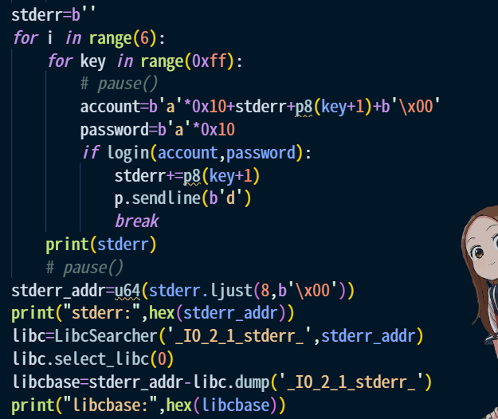
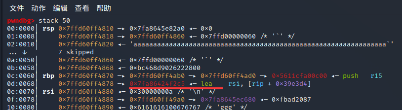

## pwn-guess
查看保护  

保护全开，很吓人，但也就是看着吓人  
该题属于暴力破解，函数sub_A43处为bug所在点，程序会比较输入的account和password是否相同，并做出相应反应，然而比较时是根据account的长度来判断（因此可以通过\x00控制截至位点），输入password处也存在漏洞（16字节的区间可以输256字节）然而由于还是太短，碰不到rbp，所以这个bug用不上 

  

真正有用的是输入0x10字节的数据后password接上了stderr，便可以通过暴力破解获得stderr了,也由此获得libcbase  

其实上边还可以用同样方法获得canary（就在stderr上边）但是此题后面用不上所以没必要拿  

然后就是想办法让函数运行one_gadget，找到程序的第二个bug，此处v1开了64个字节，而允许读入65字节，控制i的位置还正好紧贴着v1，因此只需要让写入第65字节时把i覆盖成大于65的数字就可以无限写入了，按照官方WP直接全写W就过去了，不过我还是没搞清楚这个one_gadget是怎么放到rbp后边的，明明前面0x41个占位的话按理应该够不着才对啊  

更改:现在清楚了，通过把i改成\x57后下一次输入就直接跳到rbp后面了，之前只看到怎样能维持不跳出for循环，忘记注意到输入位置也是与i相关的。