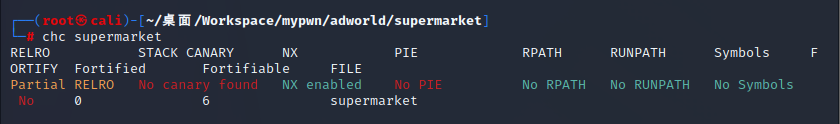
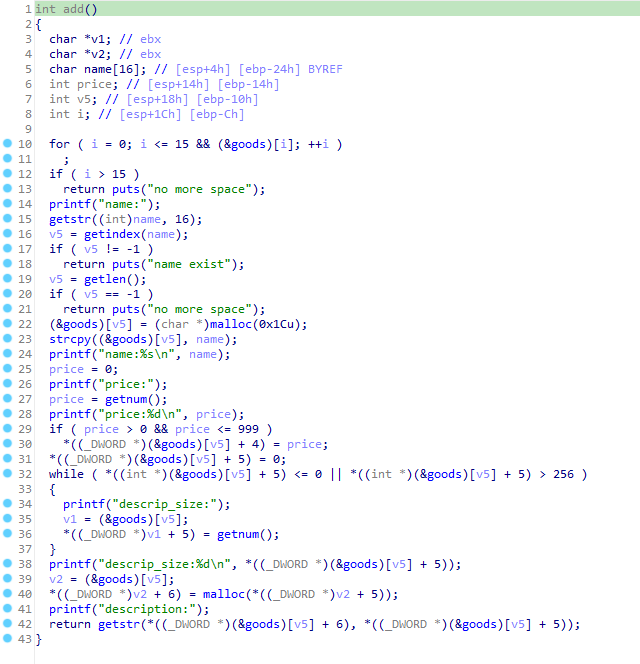
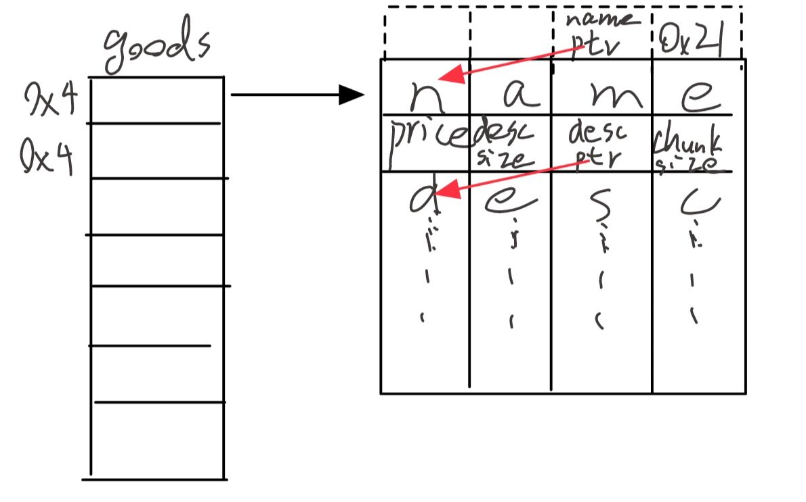
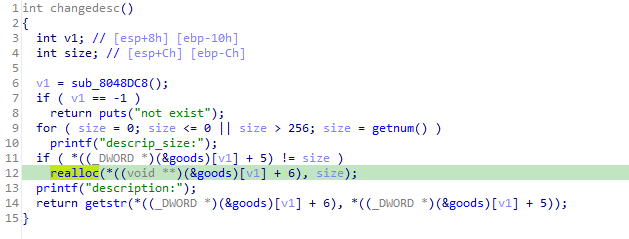
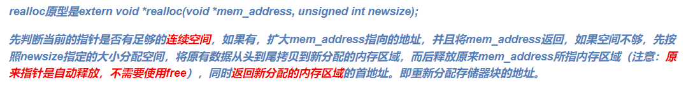
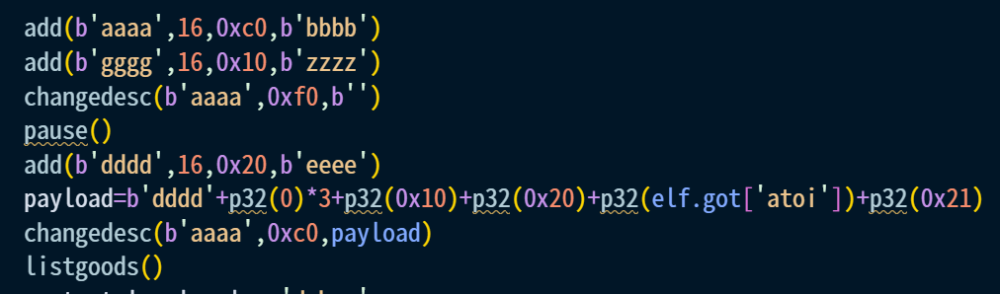
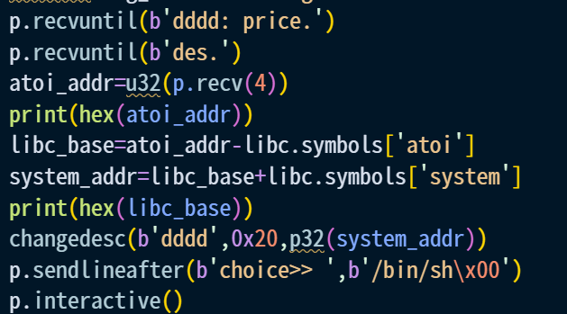

## supermarket
32位堆题  
checksec  
  
发现没开pie和Full Relro，这点降低了很多难度  
重点看add函数和changedesc函数  
  
依次输入商品的name price descsize desc，descsize的允许范围是1-256，添加商品后的存储结构如下   
  
其中desc可以进行更改，先输入新desc的大小，使用realloc进行分配，如果比原来的大就给他分配新空间  
  
  
而bug产生的原因就是虽然为新desc开辟了空间，但是good结构体中指向desc的指针使用的还是以前的，新写入的desc也还是存放在了旧空间。    
通过构造一个商品good0后改变其desc，使原desc被放进unsortedbins，此时再构造一个新商品就会直接从ubsortedbins中取空间，便能让这个新商品全在good0的旧desc中了，之后通过编辑good0的desc便能自由支配新商品。  
此处要注意的要点有以下几个：
1. 原desc的大小需要大于0x80，否则会被放进fastbin
2. 构造good0后需要在下面接着构造个good1才能再释放desc，否则relloc时desc会直接向下扩展
  
  
由此得到libcbase  
接下来再对atoi的got表进行修改，改成system的地址，目标达成  
