## whoami
考察栈迁移
首先礼貌性checksec  
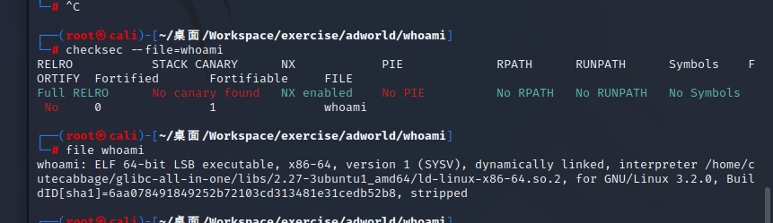
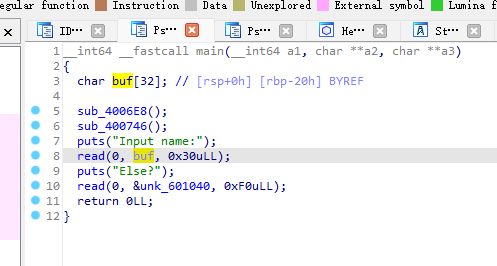
第一个read处存在栈溢出，但只覆盖rbp和rbp后8字节  
由于后面还在0x601040（bss段）处read，可以在此处布置栈再将栈转移到bss处即可  
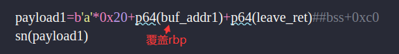
构造payload2时可以泄露puts函数地址得到libc偏移，同时可以重复利用main函数中现有的read函数（上图第10行）
（由于ROPgadget没有找到pop_rbx，否则可以直接实现其他地址写入）
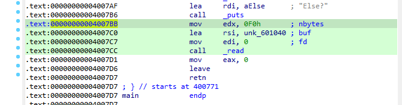
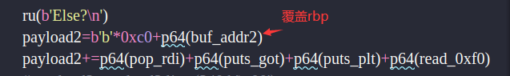
获得libcbase  
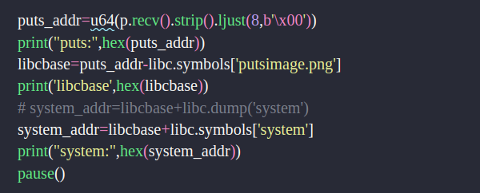
后边随意发挥
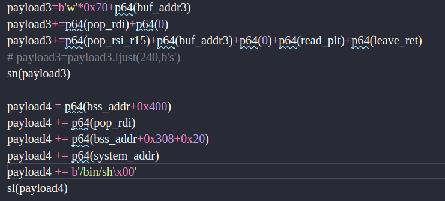

在完成此题时遇到的问题  
第一：libc使用kali的libc时打不通，但是远程的能打通，使用patchelf更改本地libc后就行了  
第二：打远程时发现题目压缩包给的libc和环境并不匹配，最后还是使用LibcSearcher后才成功  
第三：不是说改了本地libc嘛，我改成了2.27-3ubuntu1_amd64后发现如果泄漏read函数的got的话会发现泄漏失败  
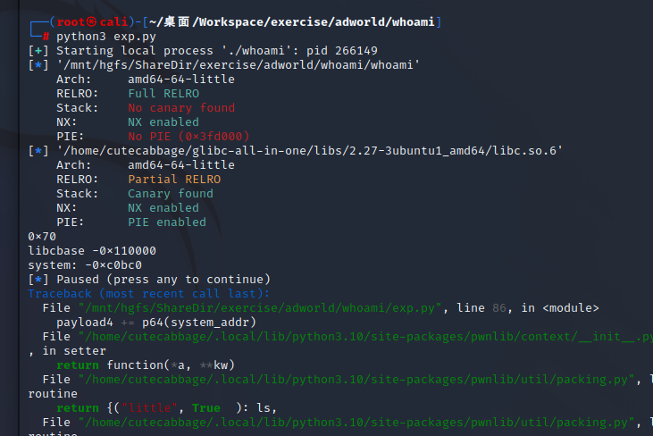
但是如果泄漏puts的got就成功了
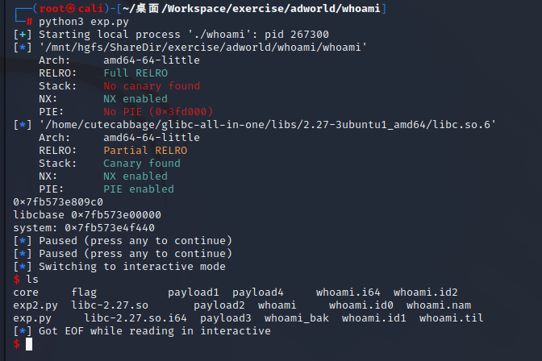
推测可能是因为read的正好有\x00所以输出时截断了，看了下还真是
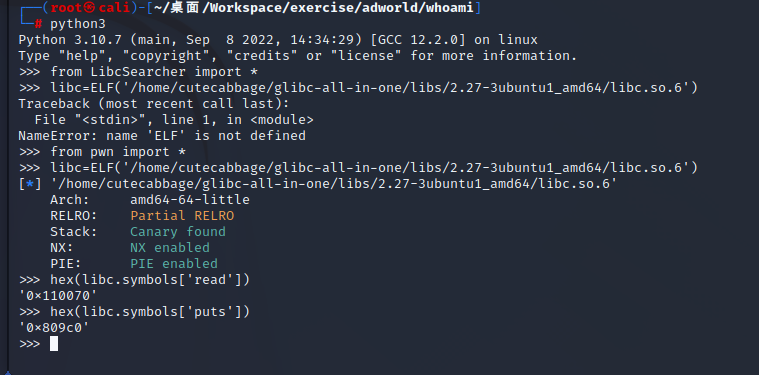
此外值得注意的点：使用了两次题目给的bss+0x40处的read（payload2和3），两次的ebp选取时前一处比后一处大，根据尝试发现若调换则更有可能产生错误。尝试后发现此处其实可以再写好多次payload

## 额外的尝试
为了熟悉栈迁移额外进行了尝试（exp3.py），尝试内容主要是试了下万能gadget的使用，并且终于理解了为什么要用7个p64(0)占位（除了六个pop还有一个rsp+8），要注意使用万能gadget后rbp被覆盖了，所以要重新赋值
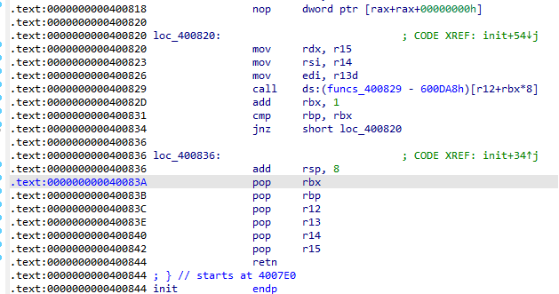
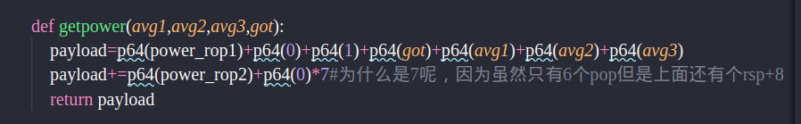
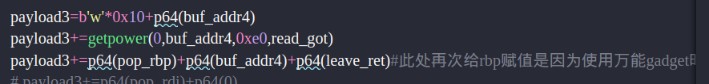