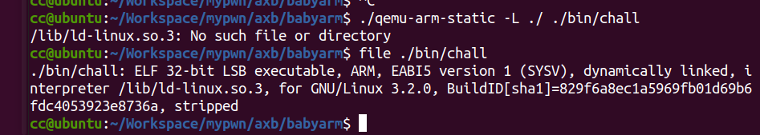

# babyarm

这题搭完arm环境后还是一直跑不起来，显示缺少ld和libc，最后发现直接和做普通题一样用patchelf就行了



```
patchelf --set-interpreter ./ld-2.27.so ./chall
patchelf --replace-needed libc.so.6 ./libc-2.27.so ./ld-2.27.so ./chall
qemu-arm-static -L ./ ./chall
```

