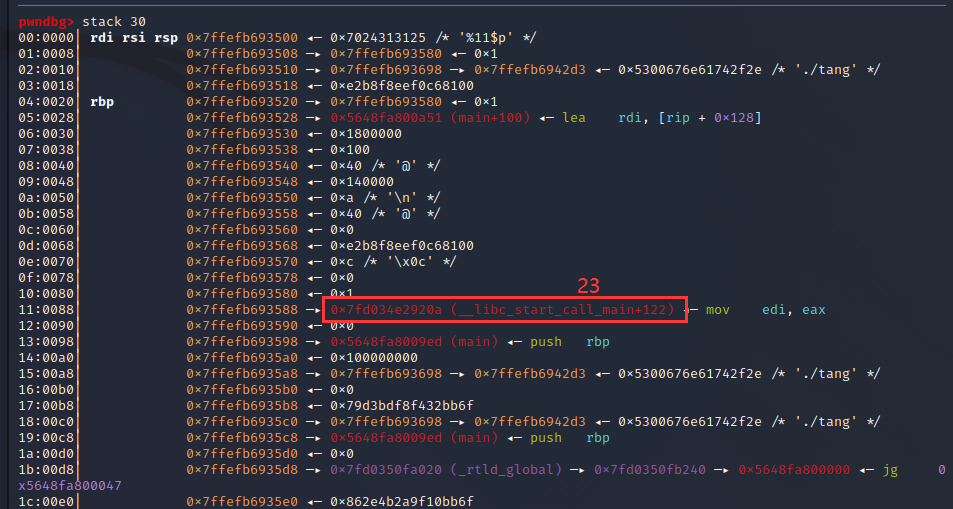
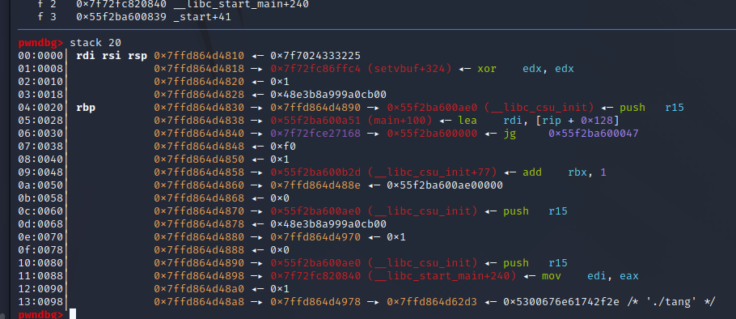
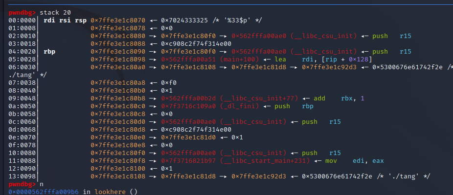
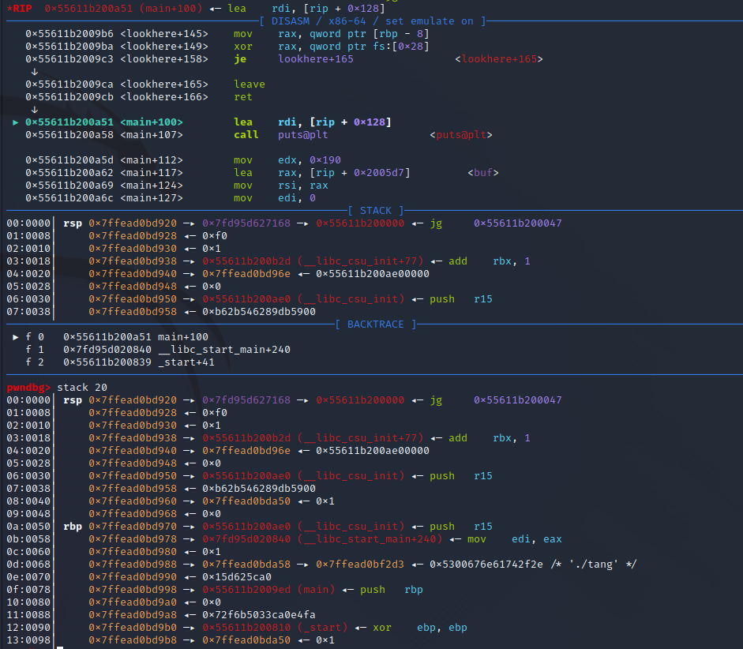

# tang  
以后再也不做cyfshow的题了，又是不给我libc，但是答案全是在已知libc的情况下的，只能说说大致思路。  
可利用的漏洞：
1. 有格式化字符串漏洞，但是只能写5字节  
2. 有栈溢出漏洞，可用空间充足  
开的保护：  
1. 保护全开  

## 过程：  
格式化字符串可泄露的有main的地址，canary，libc函数位置，栈地址，也就是说基本全能泄露，但实际上能泄露libc函数地址都是funname+offset，而实际测试后发现在不同libc下这个偏移会有所不同，而且能泄露的函数也变化很大。  
  
  
  
也就是说泄露libcbase这个步骤在不知道libc的情况下是做不了的（而我看到的wp都是直接获得，也就是说他们做的时候是有libc的）。  
为了重复利用漏洞必须要得到canary和main函数地址，观察栈发现存在栈溢出漏洞的main函数结束后返回到的到是__libc_start_main+offset（其实应该所有的main函数都是这样）因此可以覆盖该字段的末尾几个字节（小端的末尾实际上是先输入的），使main函数返回__libc_start_main实现重复利用漏洞。  
但是因为libc不确定所以这个offset实际上也是无法得知的，如果知道libc的话可以直接得到__libc_start_main的后几位，覆盖就完了。但其实这一步也不一定需要libc，可以通过爆破解决。  
  
**（上面这些步骤我也想过先想办法泄露libc得到版本，然后就能下载完libc后随便打了，但可惜格式化字符串那没办法得到可利用的libc函数）**  
后面的步骤没什么难得，获得libc偏移后得到one_gadget的地址。（但其实这些步骤在不知道libc的情况下还是不好做，不管了，就看个思路吧）  
