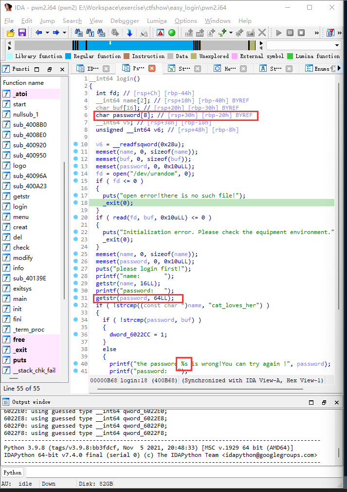
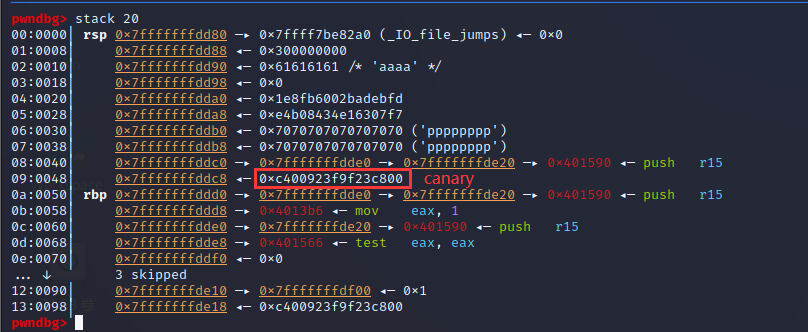
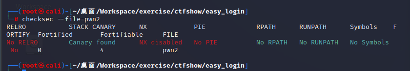
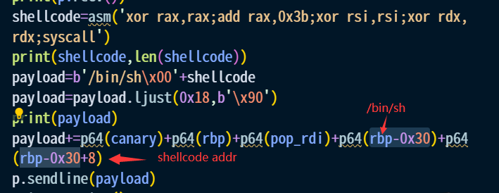
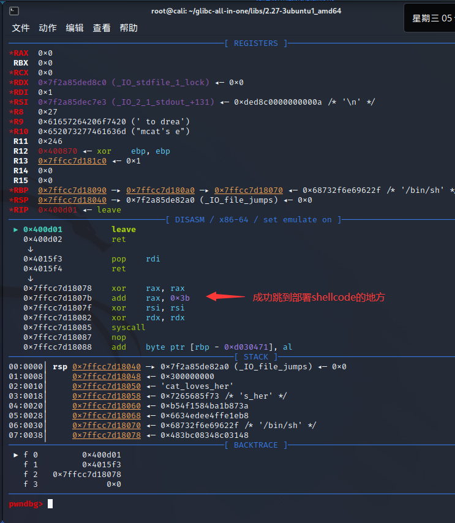

## easy_login
同样是一道简单题，但我做这题时花了好长时间，因为一开始没往栈执行的方向上考虑（之前这块做得比较少）  
和上一题的题干基本相同，产生错误的函数也一样，但这次没有后门函数，必须自己构造shellcode  

发现password存储处后接着canary和rbp，因此可以泄露这两个关键信息  

但是会发现这个password只能写入64位，即只能部署rbp后0x18字节的内容，如果此时用输出puts.got的方法，则直接用完了0x18字节，虽然获得了libcbase但无法进行后续操作  
想了很久后我才意识到这次的程序没有开NX保护，也就是说我可以在
输入password的地方部署shellcode，只需要让函数跳转到此处即可  
补上checksec  

调用execve的步骤如下，使rax为系统调用号0x3b，rdi为字符串'/bin/sh'的地址，rsi和rdx均为0  
因为知道了rbp中的值，因此便知道了栈上所有数据的地址，其中password起始处对应rbp-0x30，如此构造payload  

此处rdi的值通过pop来调整而没有写在shellcode里，这是因为在shellcode中设置的话会产生\x00（具体会不会产生不好的影响我也不清楚，按理是不会，因为这个输入函数是出题人自定义的，不会因为\x00终止读入） 

此外还有一点很奇怪，在打远程时缺少了context.log_level=True会显示timeout，有了上面那行代码就能正常getshell，不清楚什么原因