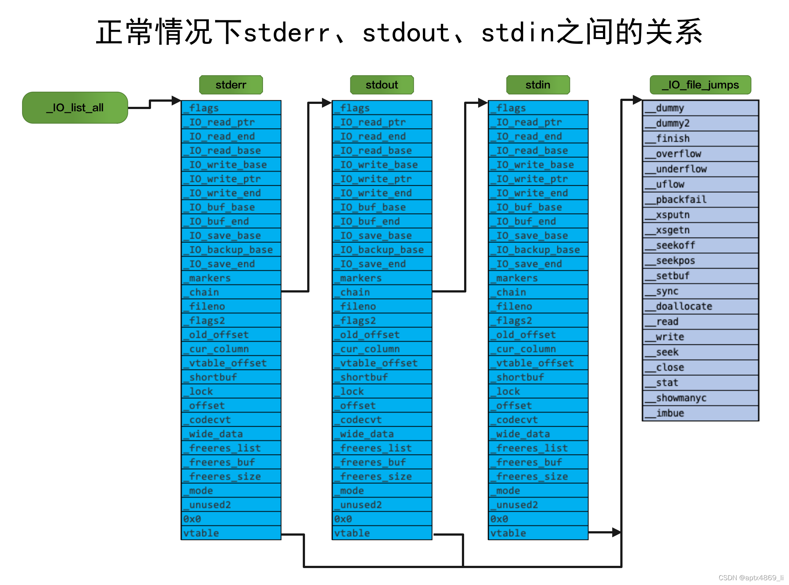
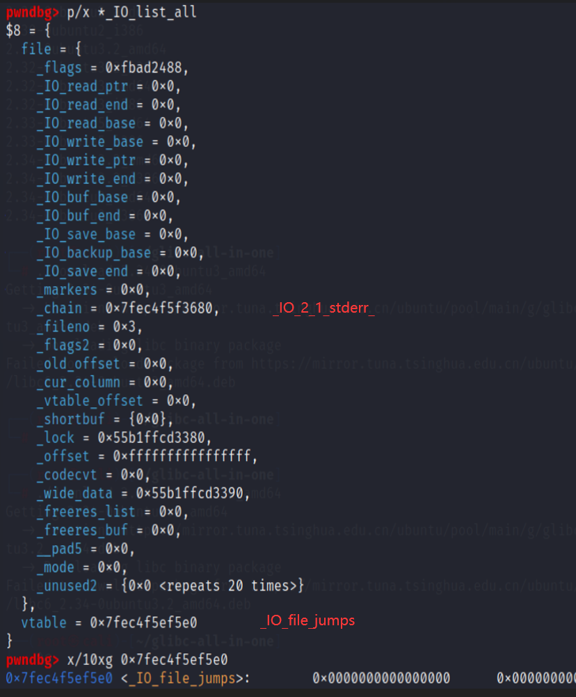

# IOFILE

https://ywhkkx.github.io/2022/03/16/IO_FILE%20pwn/
https://blog.csdn.net/aptx4869_li/article/details/122971995

FSOP描述的最清晰易懂的文章https://ywhkkx.github.io/2022/04/01/IO_FILE%E6%BA%90%E7%A0%81%E5%88%86%E6%9E%90%EF%BC%9AFSOP/



FILE结构在程序执行fopen等函数时会进行创建，分配在堆中，以链表的形式串联。  
但系统会在一开始自动创建三个FILE，他们是stdin、stdout、stderr，位于libc。  


_IO_FILE_plus变量指向FILE链表的头部，在没有创建其他文件结构时其指向stderr，然后依次是stdout和stdin。  
```
struct _IO_FILE_plus
{
    _IO_FILE    file;
    _IO_jump_t   *vtable;
}
```
使用p/x *_IO_list_all查看_IO_list_all
  
尝试：FILE链表为stderr->stdout->stdein，以下几种写法都能打印出stdout结构
```
p/x *(struct _IO_FILE_plus*)0x7f********** //stdout的地址
p/x *stdout

p/x *(struct _IO_FILE_plus*)_IO_2_1_stderr_.file._chain
p/x *_IO_2_1_stderr_.file._chain
_IO_FILE
```
struct _IO_FILE
{
  int _flags;                /* High-order word is _IO_MAGIC; rest is flags. */

  /* The following pointers correspond to the C++ streambuf protocol. */
  char *_IO_read_ptr;        /* Current read pointer */
  char *_IO_read_end;        /* End of get area. */
  char *_IO_read_base;        /* Start of putback+get area. */
  char *_IO_write_base;        /* Start of put area. */
  char *_IO_write_ptr;        /* Current put pointer. */
  char *_IO_write_end;        /* End of put area. */
  char *_IO_buf_base;        /* Start of reserve area. */
  char *_IO_buf_end;        /* End of reserve area. */

  /* The following fields are used to support backing up and undo. */
  char *_IO_save_base; /* Pointer to start of non-current get area. */
  char *_IO_backup_base;  /* Pointer to first valid character of backup area */
  char *_IO_save_end; /* Pointer to end of non-current get area. */

  struct _IO_marker *_markers;

  struct _IO_FILE *_chain;

  int _fileno;
  int _flags2;
  __off_t _old_offset; /* This used to be _offset but it's too small.  */

  /* 1+column number of pbase(); 0 is unknown. */
  unsigned short _cur_column;
  signed char _vtable_offset;
  char _shortbuf[1];

  _IO_lock_t *_lock;
#ifdef _IO_USE_OLD_IO_FILE
};
```
```
_IO_jump_t
```
struct _IO_jump_t
{
    JUMP_FIELD(size_t, __dummy);
    JUMP_FIELD(size_t, __dummy2);
    JUMP_FIELD(_IO_finish_t, __finish);
    JUMP_FIELD(_IO_overflow_t, __overflow);
    JUMP_FIELD(_IO_underflow_t, __underflow);
    JUMP_FIELD(_IO_underflow_t, __uflow);
    JUMP_FIELD(_IO_pbackfail_t, __pbackfail);
    /* showmany */
    JUMP_FIELD(_IO_xsputn_t, __xsputn);
    JUMP_FIELD(_IO_xsgetn_t, __xsgetn);
    JUMP_FIELD(_IO_seekoff_t, __seekoff);
    JUMP_FIELD(_IO_seekpos_t, __seekpos);
    JUMP_FIELD(_IO_setbuf_t, __setbuf);
    JUMP_FIELD(_IO_sync_t, __sync);
    JUMP_FIELD(_IO_doallocate_t, __doallocate);
    JUMP_FIELD(_IO_read_t, __read);
    JUMP_FIELD(_IO_write_t, __write);
    JUMP_FIELD(_IO_seek_t, __seek);
    JUMP_FIELD(_IO_close_t, __close);
    JUMP_FIELD(_IO_stat_t, __stat);
    JUMP_FIELD(_IO_showmanyc_t, __showmanyc);
    JUMP_FIELD(_IO_imbue_t, __imbue);
};
```

- printf/puts 最终会调用 _IO_file_xsputn
- fclose      最终会调用 _IO_file_finish
- fwrite      最终会调用 _IO_file_xsputn
- fread       最终会调用 _IO_fiel_xsgetn
- scanf/gets  最终会调用 _IO_file_xsgetn

vtable 劫持
p*(struct _IO_jump_t*)_IO_list_all.vtable

FSOP构造结构

```

IO_FILE_plus struct:
{
     _flags:  0x68732f6e69622f  / / / bin / sh
     _IO_read_ptr:  0x61        / / overwrite old_top_chunk's size
     _IO_read_end:  0x0
     _IO_read_base:  0x7fde9e8af510  / / 篡改bk，unsortedbin attack
     _IO_write_base:  0x0      / / 0
     _IO_write_ptr:  0x1       / / 1
     _IO_write_end:  0x0
     _IO_buf_base:  0x0
     _IO_buf_end:  0x0
     _IO_save_base:  0x0
     _IO_backup_base:  0x0
     _IO_save_end:  0x0
     _markers:  0x0         / / fake_vtable
     _chain:  0x0
     _fileno:  0x0
     _flags2:  0x0
     _old_offset:  0x7fde9e52f3a0   / / 将fake_vtable的__overflow篡改为system地址
     _cur_column:  0x0
     _vtable_offset:  0x0
     _shortbuf:  0x0
     _lock:  0x0
     _offset:  0x0
     _codecvt:  0x0
     _wide_data:  0x0
     _freeres_list:  0x0
     _freeres_buf:  0x0
     __pad5:  0x0
     _mode:  0x0       / / 0
     _unused2:  0x0
     vtable:  0x55f8c948f550   / / 指向top[ 12 ]，即_markers的地址
}
```