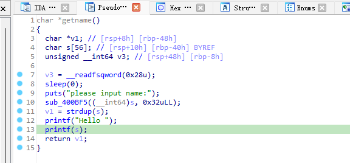
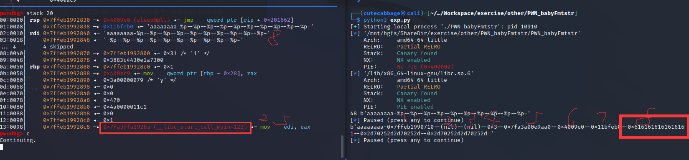
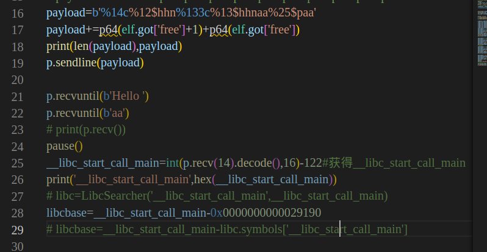
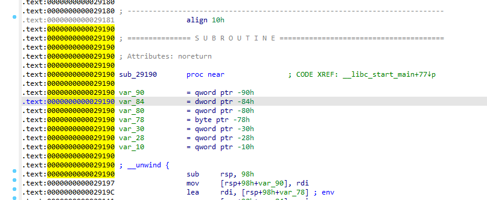
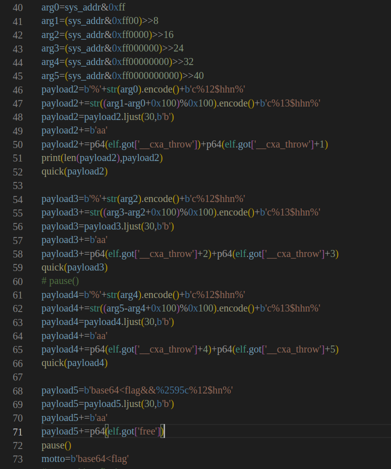
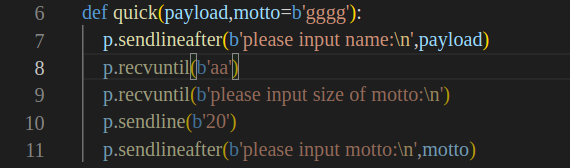
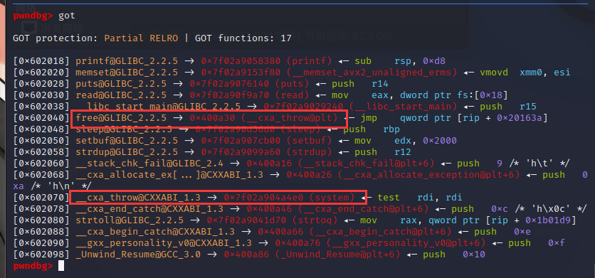
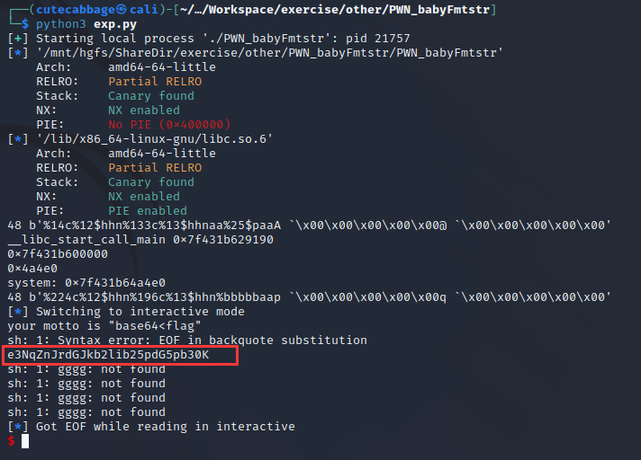

## PWN_babyFmtstr
本题考察格式化字符串漏洞改写got表

通过传入s='aaaaaaaa-%p--%p--%p--%p--%p--%p--%p--%p--%p--%p-'
可以得到字符串开始处对应第8个参数

同时可以发现第25个参数处为__libc_start_call_main，可以凭借此获得libcbase  
为了重复利用漏洞，可以将main函数结尾的free函数的got表改成main函数地址  
main函数地址为0x400E93  
构造payload1,同时完成改造got.free和获取libcbase

按理可以通过__libc_start_call_main获取libc，但不知道为什么LibcSearcher始终不能得到正确的libc（现在知道了，就是因为下面所说的没有__libc_start_main这个符号），只能直接导入本地的libc  
然而在真正获取libcbase时发现libc的符号字典中貌似并没有__libc_start_call_main（只有__libc_start_main，但是这两个还是有所不同），只能在ida中找到疑似对应__libc_start_call_main的地方（0x0000000000029190，后来证实这个地址是正确的）

因此可以获取到system的函数地址，选择将got.__cxa_throw的地址改成system   
分成6次改写，每次改一字节（此处每次控制以aa结尾是为了程序分段recv，直接一次性recv到'motto\n'就会报错，我也不知道为什么，猜测是recv有最大长度限制）

再次改动got.free，改成plt.__cxa_throw，这样下次调用free时就能直接调用system了  
改写后的got表

getflag

此处得到flag的base值，解码后即可（防止shell中屏蔽了cat，空格等词）

